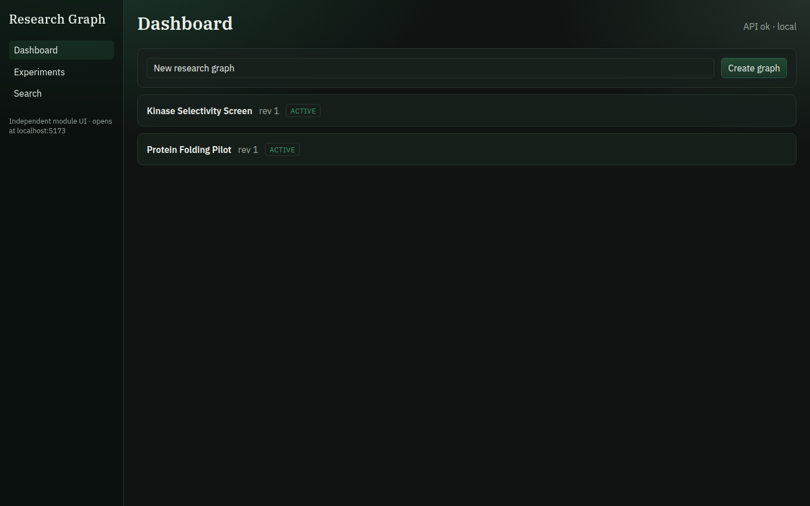
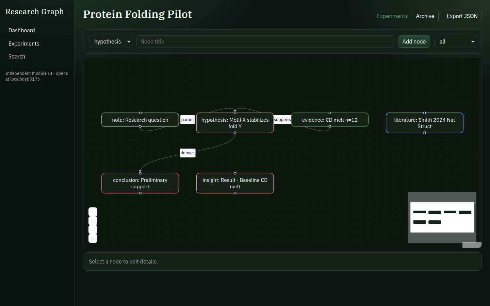
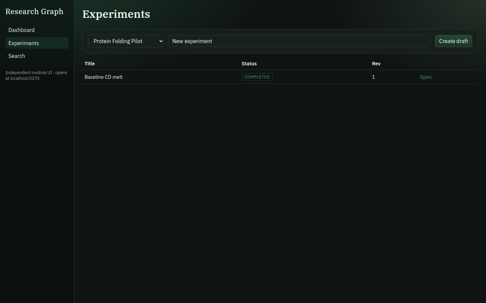
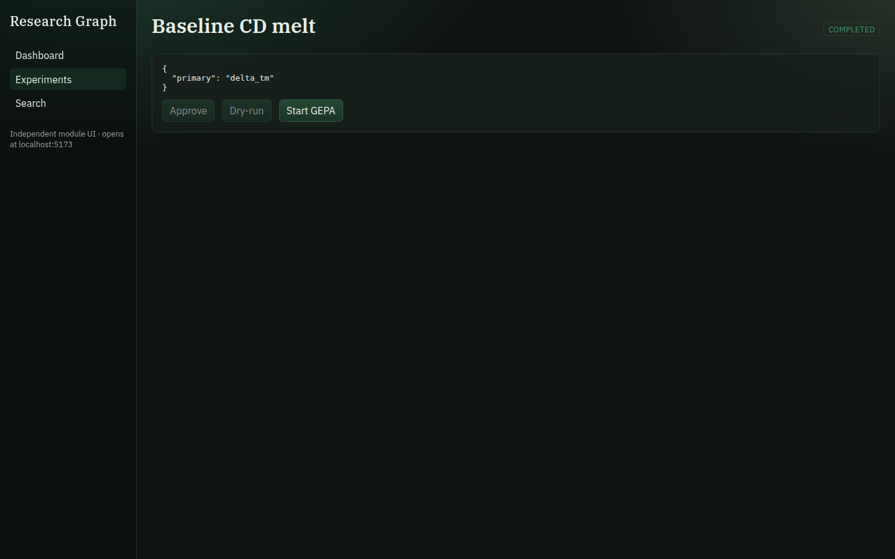
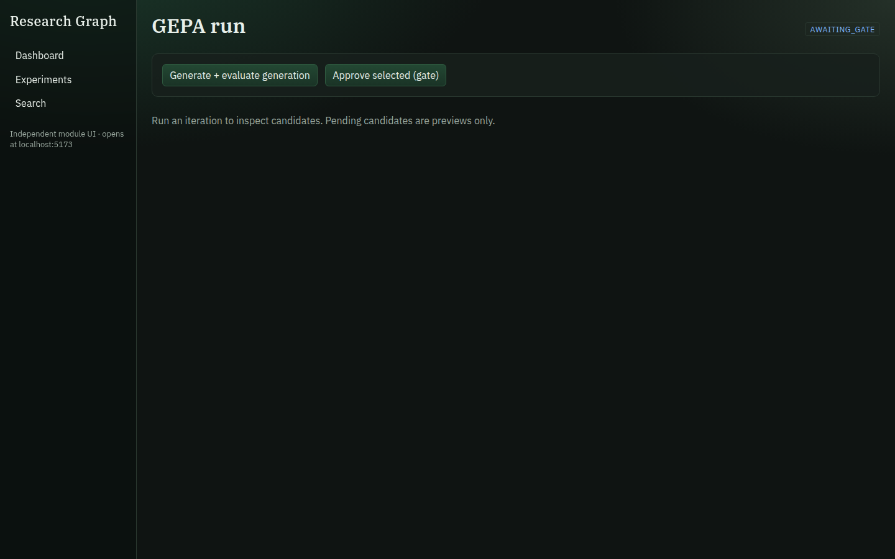
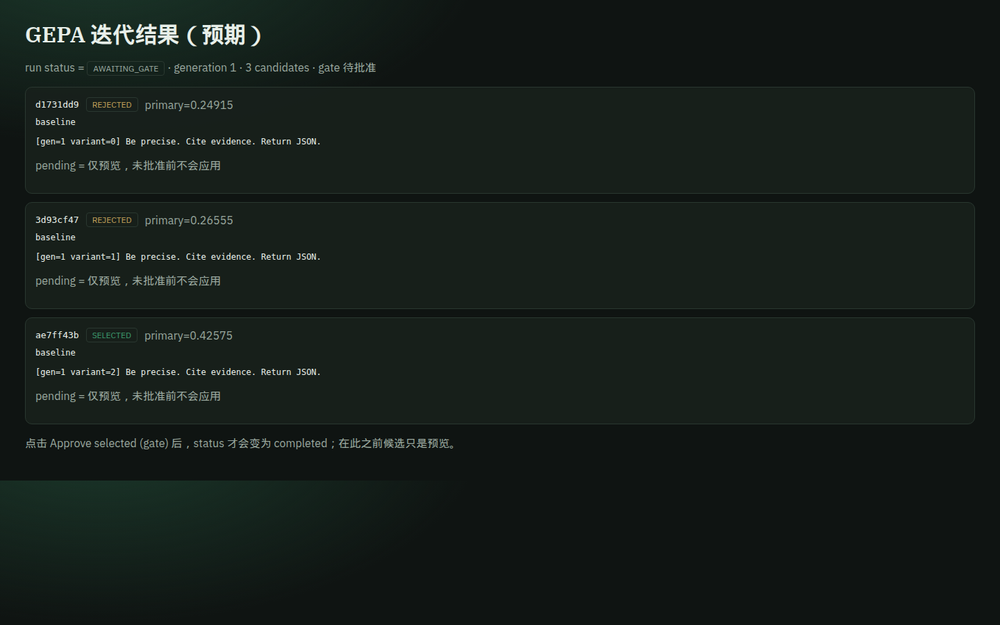
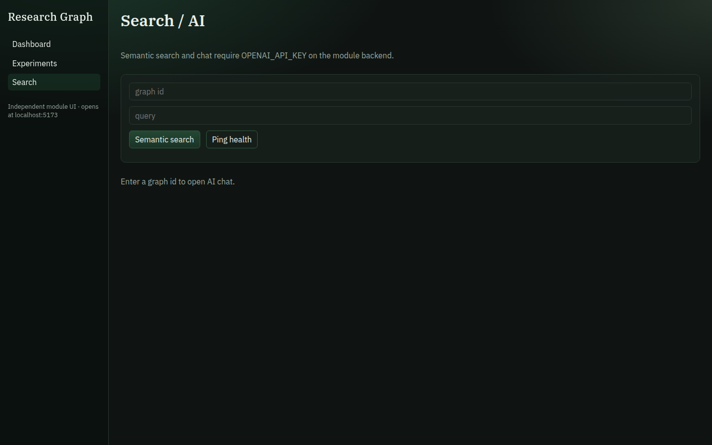
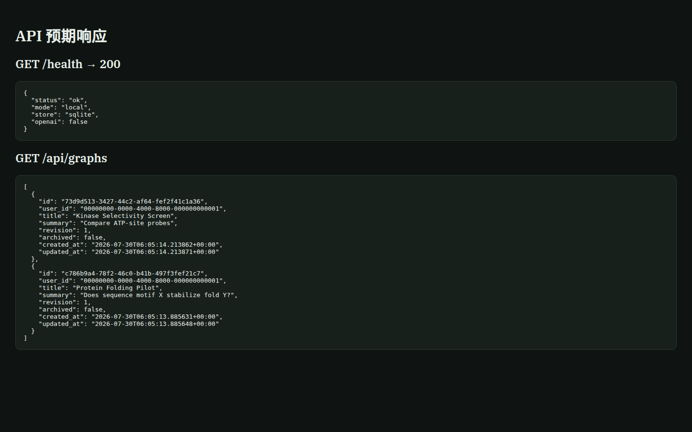

# Research Graph 使用说明（可视化版）

本文说明如何启动 **Research Graph** 独立模块、界面上怎么操作，以及每一步的**预期结果**（配截图）。

> 模块路径：`research-graph/`（不改动 MedHorizon 主仓代码）  
> 演示数据：示例图 **Protein Folding Pilot**、实验 **Folding Baseline**、一条待门控的 GEPA run

---

## 0. 启动方式

在仓库根目录执行：

```bash
# 后端（默认 127.0.0.1:8000，无 Supabase 时用本地 SQLite）
cd research-graph/backend
PYTHONPATH=.. python3 -m uvicorn backend.main:app --host 127.0.0.1 --port 8000

# 前端（另开终端）
cd research-graph/frontend
npm install
npm run dev -- --host 127.0.0.1 --port 5173
```

### MedHorizon 侧栏突出卡片（不改核心代码）

Research Graph 通过 **HTTP 集成接口** 注入会话侧栏顶部的突出卡片：

```bash
# MedHorizon web 已在 :4444 时，启动网关（代理并注入脚本）
python3 research-graph/scripts/medhorizon-gateway.py
# 或: bun research-graph/scripts/medhorizon-gateway.ts
# 浏览器打开 http://127.0.0.1:5199  ← 侧栏顶部可见 Research Graph 卡片
```

备选：打开 http://127.0.0.1:8000/embed/bookmarklet ，用书签在已打开的 MedHorizon 页注入。

| 接口 | 预期 |
|------|------|
| `GET /integration/manifest` | 集成契约，`modifies_core: false` |
| `GET /integration/sidebar-card` | 突出卡片 JSON（图谱/实验/待门控计数 + CTA） |
| `GET /embed/sidebar-card.js` | 注入脚本（查找 `.session-sidebar` 并 prepend 卡片） |

浏览器打开：

| 入口 | URL | 预期 |
|------|-----|------|
| 前端 UI | http://127.0.0.1:5173 | 看到左侧导航：Graphs / Experiments / Search+AI |
| API 健康检查 | http://127.0.0.1:8000/health | `{"status":"ok"}` |
| OpenAPI | http://127.0.0.1:8000/docs | Swagger 文档 |

开发鉴权：前端自动带 `Authorization: Bearer local-dev`；本地可跳过 JWT。

可选环境变量：

| 变量 | 作用 |
|------|------|
| `DATABASE_URL` | 未设置时用 `research-graph/backend/data/research_graph.db` |
| `OPENAI_API_KEY` | 未设置时 Search / AI Chat 返回 **503**（属预期） |
| `RESEARCH_GRAPH_API` | MedHorizon 插件调用本 API 的基址，默认 `http://127.0.0.1:8000` |

---

## 1. Dashboard — 图列表

**怎么用**

1. 打开首页（Graphs）
2. 在标题框输入图名，点 **Create**
3. 在列表中点某一行进入图编辑页

**预期结果**

- 顶部标题为 **Research Graph**
- 列表展示图名、状态（如 `active`）、创建时间
- 新建后列表立刻多出一行，并可点击进入



---

## 2. Graph View — 画布编辑

**怎么用**

1. 从 Dashboard 点进一张图
2. 用 **Add Hypothesis / Method / Result / Literature** 添加节点
3. 拖拽节点调整位置；点选节点可编辑标题 / 摘要 / 状态
4. 需要时用 **Export Markdown** / **Import Markdown**；归档用 **Archive**

**预期结果**

- 中央为 React Flow 画布，节点按类型着色（hypothesis / method / result / literature）
- 左侧属性面板随选中节点更新
- 导出得到 Markdown；导入会重建节点结构
- Archive 后图状态变为归档（列表可见）



---

## 3. Experiments — 实验列表

**怎么用**

1. 左侧点 **Experiments**
2. 选择关联的 graph、填写实验名，点 **Create**
3. 点实验行进入详情

**预期结果**

- 列表显示实验名、所属图、状态（如 `draft`）
- 新建成功后出现在列表中，并可进入详情页



---

## 4. Experiment View — 规格与运行

**怎么用**

1. 进入某个实验
2. 在 Spec 中填写：`hypothesis_id`、`method_id`、`dataset`、`metrics`、`compute`、`seed`、`budget`
3. 点 **Save Spec**
4. 点 **Create Run** 登记一次运行
5. 可选：**Promote Result Node**（把结果写回关联图）、**Start GEPA**

**预期结果**

- Spec 保存后页面仍显示刚填的内容
- Runs 列表出现新 run（含 status / seed）
- Promote 成功时，对应 Graph 上会出现新的 Result 节点
- Start GEPA 会跳到 GEPA 页并开始/展示一轮优化



---

## 5. GEPA — 优化与人工门控

**怎么用**

1. 从实验页 **Start GEPA**，或直接打开 `/gepa/:runId`
2. 若状态为 `awaiting_gate`：审阅候选，选一个 **Accept** 或 **Reject**
3. Accept 后可继续生成下一轮候选（受 `max_iterations` / budget 约束）

**预期结果（门控前）**

- 状态为 **awaiting_gate**
- 展示候选卡片（prompt / score / rationale）
- Accept / Reject 按钮可用



**预期结果（有候选时）**

- 每个候选显示分数与简短理由
- Accept 后状态推进；Reject 后可结束或回到可重试状态
- 超过预算/迭代上限时停止，并保留可复现元数据（seed、iteration）



---

## 6. Search + AI

**怎么用**

1. 打开 **Search+AI**
2. Search：输入查询，点搜索
3. AI Chat：输入问题，发送

**预期结果**

| 条件 | 预期 |
|------|------|
| 已配置 `OPENAI_API_KEY` | 返回检索片段 / 对话回复 |
| **未**配置 Key（本地默认） | API **503**，界面提示不可用 —— **这是正常行为**，不是前端坏了 |



---

## 7. API 层预期（给联调 / 插件用）

常用端点（均在 `http://127.0.0.1:8000`）：

| 方法 | 路径 | 预期 |
|------|------|------|
| GET | `/health` | `{"status":"ok"}` |
| GET | `/graphs` | 图数组 |
| GET | `/graphs/{id}` | 含 `nodes` / `edges` |
| GET | `/experiments` | 实验列表 |
| POST | `/experiments/{id}/runs` | 创建 run |
| POST | `/gepa/runs` | 创建 GEPA，常进入 `awaiting_gate` |
| POST | `/gepa/runs/{id}/decide` | `{"decision":"accept","candidate_id":"..."}` |
| GET | `/artifacts` | 制品列表；可下载 |
| POST | `/sync/outbox` | 写入同步 outbox |

无 Key 时 AI 相关路由返回 503；带错误 JWT 时受保护路由返回 401。



---

## 8. MedHorizon 插件（可选）

不修改 MedHorizon 核心，仅通过配置叠加启用：

```bash
export OPENSCIENCE_CONFIG_DIR=/path/to/research-graph/medhorizon-plugin
export RESEARCH_GRAPH_API=http://127.0.0.1:8000
# 再按原方式启动 openscience / MedHorizon CLI
```

插件提供工具：`atlas_graph`、`atlas_experiment`、`atlas_gepa`、`atlas_sync`，以及对应 skills / agents。  
预期：Agent 可通过 HTTP 读写本模块的图、实验、GEPA 与 sync outbox。

详见：`research-graph/medhorizon-plugin/README.md`。

---

## 9. 端到端验收清单（对照截图）

按顺序自测，结果应与上图一致：

1. [ ] Dashboard 能列出/创建图 → 见图 01  
2. [ ] Graph 能增改节点并导出 Markdown → 见图 02  
3. [ ] 能创建实验并关联图 → 见图 03  
4. [ ] 能保存 Spec、创建 Run → 见图 04  
5. [ ] GEPA 进入 `awaiting_gate` 并可门控 → 见图 05 / 07  
6. [ ] Search/AI 无 Key 时明确失败（503）→ 见图 06  
7. [ ] `/health` 与 CRUD API 正常 → 见图 08  

自动化测试（后端）：

```bash
cd research-graph/backend && python3 -m pytest -q
```

预期：全部通过（当前约 21 tests）。

---

## 10. 截图索引

| 文件 | 页面 | 说明 |
|------|------|------|
| `screenshots/01-dashboard.png` | Graphs | 列表 + 创建 |
| `screenshots/02-graph-view.png` | Graph 画布 | 多类型节点 |
| `screenshots/03-experiments.png` | Experiments | 列表 + 创建 |
| `screenshots/04-experiment-view.png` | Experiment | Spec / Runs |
| `screenshots/05-gepa-awaiting.png` | GEPA | 门控等待 |
| `screenshots/06-search-ai.png` | Search+AI | 双栏入口 |
| `screenshots/07-gepa-candidates.png` | GEPA | 候选示意 |
| `screenshots/08-api-responses.png` | API | 响应示意 |
| `screenshots/09-sidebar-card-rg-ui.png` | RG 侧栏 | 模块内突出卡片 |
| `screenshots/10-sidebar-card-medhorizon-inject.png` | MedHorizon 注入 | 会话侧栏顶部卡片 |
| `screenshots/11-embed-card.png` | `/embed/card` | iframe 嵌入面 |

截图由本地 `127.0.0.1:5173` + 演示库实际渲染采集（部分 API/候选页为同源数据的静态示意页，布局与真实 UI 一致）。
