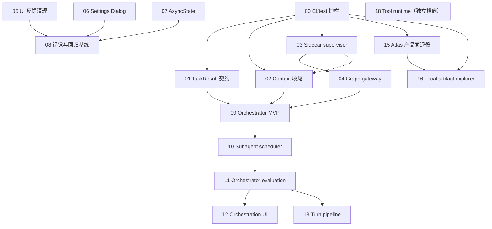

# MedHorizon 下一阶段优化路线图

> 状态：Planned  
> 更新：2026-08-02
> 执行入口：[tasks/plans/README.md](plans/README.md)  
> 总检查清单：[tasks/todo.md](todo.md)

## 目标

在不重写现有运行时的前提下，把下一阶段工作拆成可独立实现、验证和回退的计划，沿五条主线推进：

1. **可靠性与架构边界**：先固定 TaskResult 语义，再收敛 Research Graph 进程、鉴权和同源访问边界。
2. **UI 一致性与视觉基线**：统一 Toast、Dialog、异步资源状态和设计令牌，并用截图与无障碍测试保护结果。
3. **Agent 统筹与可维护性**：以薄 Orchestrator 路由命名 worker，补齐调度与评测后，再拆分后端 turn pipeline。
4. **工具运行时资源效率**：无状态 Python/R 默认走一次性进程，统一 process policy、输出限界、kernel 生命周期和 Batch 并发边界。
5. **产品面收敛**：Stage 与 Research Graph 接管研究阶段/图谱体验；Atlas UI 隐藏、云功能默认关闭，只按真实调用图保留兼容能力。

## 已确定的架构决策

- 新增命名 `orchestrator` primary agent；legacy `research` 在灰度期保持默认和回退。
- Orchestrator v1 只路由固定命名 worker，不接受模型动态拼装 toolset，也不引入持久化 DAG 引擎。
- 父 Agent 不暴露 `read`、`bash` 或 `atlas_*`；工具选择上移为 worker 选择。`atlas_graph`、`atlas_stage`、`atlas_sync` 暂作为 Research Graph 兼容标识保留。
- TaskResult 契约先于 Orchestrator；失败、取消、超时和解析错误不得压成成功文本。
- CLI/Hono 是浏览器访问 Research Graph 的唯一入口；浏览器不持有 sidecar token，不知道 sidecar 端口。
- 保留 FastAPI/React Research Graph sidecar；本轮只收敛生命周期、协议、安全和嵌入边界。
- `@synsci/ui` 是 Toast、Dialog 和 AsyncState 等交互原语的唯一事实源。
- 视觉系统采用 content/UI/code 三层字体语义；是否扩大到全站由截图、可读性和无障碍结果决定。
- Stage 与 Research Graph 是唯一面向用户的研究阶段/图谱工作流；不按 `atlas/` 目录或 `atlas_*` 前缀批量删除共享/兼容代码。
- Atlas 云能力默认关闭；短期只允许通过单一 `OPENSCIENCE_ENABLE_ATLAS=1` 恢复非 UI 的后端 bridge、自动生命周期和必要 CLI 兼容路径以做验证，默认启动不得执行 Atlas login、sync、wallet、CLI 安装或外部请求。该 flag 不恢复 Canvas、artifacts、账户或 billing UI；完整 UI 回滚需独立 revert Plan 15 Task 2/3。
- 独立、无状态的 Python/R 计算默认由 `bash` 启动一次性解释器；`notebook`/`rkernel` 只在跨调用状态或富输出确有收益时显式使用，GPU/大内存/长时任务继续交给 compute worker/remote node。
- 本地 Bash/sandbox 不等同计算节点；Plan 18 用共享 ProcessSupervisor 统一 deadline、并发、env、redaction、bounded output 和 terminal receipt，但不宣称提供 CPU/RSS 硬隔离。

## 计划索引

| #   | 计划                                                                      | 优先级 | 依赖                 | 可并行                        | 状态        |
| --- | ------------------------------------------------------------------------- | ------ | -------------------- | ----------------------------- | ----------- |
| 00  | [CI 与测试前置护栏](plans/00-ci-test-guardrails.md)                       | P0     | 无                   | 05、06、07                    | In progress |
| 01  | [TaskResult 契约](plans/01-task-result-contract.md)                       | P0     | 00                   | 02、03、05、06                | Done        |
| 02  | [Agent context 收尾](plans/02-agent-context-closeout.md)                  | P0     | 00、03（仅 RG soak） | 01、03、05、06、07            | Planned     |
| 03  | [Research Graph supervisor](plans/03-research-graph-supervisor.md)        | P0     | 00                   | 01、02、05、06                | Done        |
| 04  | [Research Graph 同源 gateway](plans/04-research-graph-gateway.md)         | P0     | 03                   | 07                            | Planned     |
| 05  | [UI 反馈通道清理](plans/05-ui-feedback-cleanup.md)                        | P1     | 无                   | 01、02、03、06、07            | Done        |
| 06  | [Settings Dialog 迁移](plans/06-settings-dialogs.md)                      | P1     | 无                   | 01、02、03、05、07            | Planned     |
| 07  | [异步资源状态统一](plans/07-async-resource-states.md)                     | P1     | 无                   | 01、02、03、05、06            | Planned     |
| 08  | [视觉系统与回归基线](plans/08-visual-system-and-regression.md)            | P1     | 05、06、07           | 09 的后半                     | Planned     |
| 09  | [Orchestrator MVP](plans/09-orchestrator-mvp.md)                          | P1     | 01、02、04           | 08                            | Planned     |
| 10  | [Subagent scheduler](plans/10-subagent-scheduler.md)                      | P1     | 09                   | —                             | Planned     |
| 11  | [Orchestrator evaluation](plans/11-orchestrator-evaluation.md)            | P1     | 10                   | —                             | Planned     |
| 12  | [Orchestration UI 与灰度](plans/12-orchestration-ui.md)                   | P2     | 11                   | 13                            | Planned     |
| 13  | [Session turn pipeline 拆分](plans/13-session-turn-pipeline.md)           | P2     | 11                   | 12                            | Planned     |
| 14  | [Atlas Canvas 架构拆分（已取代）](plans/14-graph-ui-architecture.md)      | —      | 由 15 取代           | —                             | Superseded  |
| 15  | [Atlas 产品面退役](plans/15-atlas-surface-retirement.md)                  | P0     | 00（后端任务）       | 01、02、03、05、06、07        | Implemented |
| 16  | [本地 Explorer 与 Session Artifacts](plans/16-local-artifact-explorer.md) | P1     | 00、15               | 01、02、03、05、06、07        | Planned     |
| 18  | [Tool 执行运行时与资源效率](plans/18-tool-runtime-optimization.md)        | P1     | 无硬依赖             | 独立横向；协调 02、10、13、16 | Planned     |

## 依赖图

## 推荐执行波次

| 波次                    | 可并行计划                     | 退出条件                                                                                  |
| ----------------------- | ------------------------------ | ----------------------------------------------------------------------------------------- |
| 0：后端合并护栏         | 00；UI 计划可并行              | frozen install 与单次 report-only coverage 生效；证据记录在 Plan 00                       |
| A：基础测量与低耦合清理 | 01、02、03、05、06、07、15、16 | 各计划 focused tests 通过；协议/UI 原语边界确定；Atlas allowlist 与本地 artifact 边界冻结 |
| B：边界接入             | 04                             | 浏览器不再直连 sidecar，权威 session binding 可用                                         |
| C：体验基线与路由 MVP   | 08、09                         | 代表页面基线获批；Orchestrator 能真实委派 literature/code/graph worker                    |
| D：调度                 | 10                             | 并发、排队、取消与超时语义稳定                                                            |
| E：上线门槛             | 11                             | 可重复 eval 达到完成率、语义正确率、上下文和安全门槛                                      |
| F：灰度与重构           | 12、13                         | 可选灰度、可观测、可回退；turn pipeline 外部行为不变                                      |
| X：工具运行时（横向）   | 18                             | ephemeral/session 路由、进程回收、输出限界、tool catalog 与 Batch 护栏有真实证据          |

同一波次内只有在不修改同一契约或同一核心文件时才并行。若共享 API，先在依赖计划中冻结契约，再分支实现消费者。

## 全局质量门槛

- 每个实施任务保持 XS/S/M，建议不超过 5 个手写文件；超过时继续拆分。
- 每个任务在自己的计划中具备明确验收标准、验证命令、依赖和预计文件。
- 逻辑与行为修改以真实实现为测试对象，尽量不使用 mock；先写 characterization 或失败用例。
- 后端 focused tests 从 `backend/cli` 运行；CI 等价完整命令为 `bun run test:coverage`。
- workspace 变更至少运行 `bun run --cwd frontend/workspace typecheck`；交互变更运行对应 Playwright spec。
- 根级类型检查使用 `bun run typecheck`。
- 服务端 API 契约变化后，从仓库根运行 `./tooling/repo/generate.ts`，并提交生成结果。
- 协议、默认 Agent 或 UI 行为变化必须保留兼容/回退路径，并在对应计划的 checkpoint 验证。
- 每完成一份计划，先更新该文件 Status，再同步 [plans/README.md](plans/README.md) 和 [todo.md](todo.md)。

## 当前验证基线

Plan 00 是后端测试数量、耗时、覆盖率、阈值和平台差异的唯一证据源；见其 [Progress](plans/00-ci-test-guardrails.md#progress)。其他计划只记录自己的 focused/characterization 结果，避免复制过时基线。

## 非阻塞产品决策

这些决策不阻塞基础计划，可在相应 checkpoint 前确定：

- Orchestrator 先作为显式 Agent，还是只对小上下文本地模型进入默认灰度。
- biology 保留 primary 身份，还是仅作为 Orchestrator worker。
- 视觉字体语义仅覆盖当前工作台壳层，还是通过验证后上移到共享主题。

## 完成定义

- 1 个前置护栏与 16 份 active 优化计划的验收标准和 checkpoint 全部完成，并有可复跑证据；已被 15 取代的 Plan 14 不再执行。
- Task failure/cancel/timeout/parse error 不会被标为 success。
- 浏览器不直连 Research Graph sidecar，且 sidecar 崩溃、重启、错误占端口均可诊断。
- workspace 只保留一套 Toast/Dialog/AsyncState 原语，核心流程有截图与无障碍回归保护。
- Atlas 产品 UI 与自动云行为默认关闭，Stage、Research Graph、BYOK/local 能力及 `atlas_*` 兼容工具有真实回归证据。
- Orchestrator 父工具开销、完成率和失败语义达到计划 11 的发布门槛，legacy `research` 回退已演练。
- 独立 Python/R 默认走一次性受控进程；persistent kernel 可预测回收，所有本地进程路径无 secret、orphan、无界输出或 Batch capability 绕过。
- 后置架构拆分不改变 API、事件顺序或用户可观察行为。
- focused tests、workspace e2e、Research Graph tests、根级 typecheck/build 以及完整 `backend/cli` 测试均通过。
