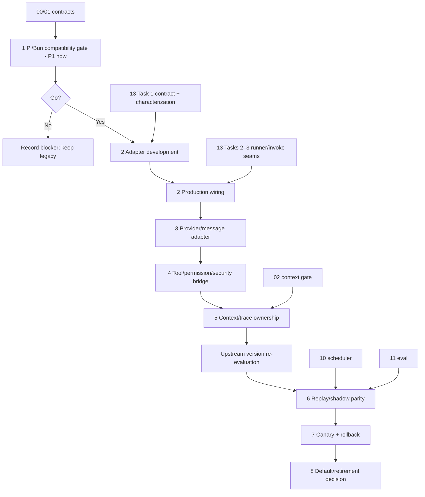

# 17 - Pi Agent Runtime 兼容迁移

**Status:** Planned  
**Priority:** P1（Task 1 兼容性闸门）；P2（Tasks 2–8 适配、灰度与切流）  
**Dependencies:** `00-ci-test-guardrails.md`、`01-task-result-contract.md`。正式接入还依赖 `02-agent-context-closeout.md`、`10-subagent-scheduler.md`、`11-orchestrator-evaluation.md`。`13-session-turn-pipeline.md` Task 1 先冻结 characterization 与 runtime contract，允许 adapter 提前开发；生产 wiring 仍与其 Tasks 2–3 的 runner/invoke seam 串行实施。

## Decision summary

Pi 有足够的低层接口支持“替换内部 Agent loop、保留 MedHorizon 外部契约”的渐进迁移，但没有一个可直接替换 MedHorizon 全栈且零改动的兼容层。

推荐只接入 `@earendil-works/pi-agent-core` 的 `Agent`/loop 能力，通过 MedHorizon 自有 `TurnRuntime` port 提供 `LegacyRuntimeAdapter` 与 `PiRuntimeAdapter` 双实现；不把产品改造成 Pi Coding Agent，也不让 Pi 接管 Session 持久化、权限、安全沙箱、工具 registry、TaskResult、API/SDK 或初期 compaction。这样改动集中在 session runtime 边界，前端、协议和大多数工具实现无需迁移。

正式迁移属于中高风险的核心运行时集成，而不是全仓大重构：任务净工作量预计 36–59 个工程日；计入 20% 的集成、上游复核与跨计划协调余量后，计划窗口约 43–71 个工程日（通常为 8–12+ 周日历时间）。若 Plan 13 的 characterization、统一 invoke envelope 和单向边界先落地，可减少约 6–10 个工程日。直接采用 Pi Coding Agent 的 SessionManager、内置工具、extension host 和 compaction 重写现有栈，预计至少扩大到 60–100+ 个工程日，并显著增加数据、权限和 UI 契约回归风险，因此不采用。

## Source baseline

本计划以 2026-08-02 的官方上游为基线：

- Pi repository commit：[`14551e769493f1c6ceac55954332ab14747ee05c`](https://github.com/earendil-works/pi/tree/14551e769493f1c6ceac55954332ab14747ee05c)
- npm：`@earendil-works/pi-agent-core`、`@earendil-works/pi-ai`、`@earendil-works/pi-coding-agent` 均为 `0.83.0`，声明 Node `>=22.19.0`
- Agent Core：[README](https://github.com/earendil-works/pi/blob/14551e769493f1c6ceac55954332ab14747ee05c/packages/agent/README.md)
- Coding Agent：[SDK](https://github.com/earendil-works/pi/blob/14551e769493f1c6ceac55954332ab14747ee05c/packages/coding-agent/docs/sdk.md)、[extensions](https://github.com/earendil-works/pi/blob/14551e769493f1c6ceac55954332ab14747ee05c/packages/coding-agent/docs/extensions.md)、[compaction](https://github.com/earendil-works/pi/blob/14551e769493f1c6ceac55954332ab14747ee05c/packages/coding-agent/docs/compaction.md)、[security](https://github.com/earendil-works/pi/blob/14551e769493f1c6ceac55954332ab14747ee05c/packages/coding-agent/docs/security.md)
- 尚不能作为已发布承诺的设计文档：[AgentHarness lifecycle](https://github.com/earendil-works/pi/blob/14551e769493f1c6ceac55954332ab14747ee05c/packages/agent/docs/agent-harness.md)、[hooks design](https://github.com/earendil-works/pi/blob/14551e769493f1c6ceac55954332ab14747ee05c/packages/agent/docs/hooks.md)、[observability design](https://github.com/earendil-works/pi/blob/14551e769493f1c6ceac55954332ab14747ee05c/packages/agent/docs/observability.md)

生产依赖必须固定精确版本和上游 commit 证据，不跟随 floating minor。Pi 声明的是 Node engine，而仓库运行在 Bun 1.3.14；是否可用必须由 Task 1 的真实 Bun import、test、build、压力与 abort/tool flow 证明，不能只依据类型兼容推断。Node 24.18.1 位于其 engine 支持范围内，仅作为同 fixture 对照组，Bun 结果才是生产 go/no-go 依据。

## Current state

- `backend/cli/src/session/prompt.ts` 拥有 turn loop、context、compaction、tool resolution、直接 subtask 路径、busy/cancel、RSI 触发和 finalize。
- `backend/cli/src/session/processor.ts` 把 AI SDK `fullStream` 转为 MessageV2/Bus 事件，并维护 tool pending/running/completed/error、retry、overflow、billing、snapshot 和 usage。
- `backend/cli/src/session/llm.ts` 是现有 provider/model/stream 边界；仓库依赖 AI SDK 5.0.119 和多组 provider adapter。
- `backend/cli/src/tool/tool.ts` 以 Zod 4 schema 为工具参数事实源，并负责验证错误提示与输出截断。
- `backend/cli/src/permission/next.ts`、Plugin `tool.execute.before/after`、Plan 10 TaskScheduler 和 Plan 18 ProcessSupervisor 分别拥有权限、hook、调度与进程安全语义。
- `backend/cli/src/session/compaction.ts` 和 `telemetry.ts` 已有 pruning、summary、handoff/circuit breaker 与隐私受限 telemetry；完成后还有 RSI trajectory/critic/distill 流程。
- 仓库当前没有 `@earendil-works/pi-*` 依赖，不能假设 Bun、打包器、provider 或 Zod→TypeBox 桥已经兼容。

## Compatibility assessment

| 能力                                   | Pi 可用接口                                                                 | 兼容度         | 所有权结论                                                                                                          |
| -------------------------------------- | --------------------------------------------------------------------------- | -------------- | ------------------------------------------------------------------------------------------------------------------- |
| Agent 循环、steering、follow-up、abort | `Agent`、`agentLoop`、`agentLoopContinue`、lifecycle events                 | 高             | Pi 可替换内部 loop；产品路径使用有 awaited subscriber barrier 的 `Agent`，不用 raw loop 承担持久化顺序              |
| 模型/provider                          | injectable `streamFn`                                                       | 中             | 优先以 `streamFn` 复用 `SessionLLM` 与现有凭据/provider；首期不迁移到 Pi provider registry                          |
| 上下文转换                             | `transformContext`、`convertToLlm`                                          | 中高           | 可做协议转换；context assembly 和初期 compaction 仍由 MedHorizon 管，避免双 prune/summary                           |
| 工具 schema 与参数验证                 | TypeBox tool schema、validated `beforeToolCall`                             | 中             | Pi schema 只作 preflight；Zod 仍是 canonical validator，必须用 parity tests 防止两套校验漂移                        |
| 权限、安全检查                         | `beforeToolCall` 可阻止执行                                                 | 中低           | 只作为 PermissionNext/selected invoker 的接入点；Pi 无内建 sandbox，不能替代 Plan 18 或 OS/container 隔离           |
| 工具错误回灌                           | throw 自动形成 `isError: true` tool result，`afterToolCall` 可改写结果/终止 | 高             | 通过 adapter 映射到现有 MessageV2 error 与模型 tool result；cancel/timeout/permission 保留专用终态                  |
| Tool 并行                              | global/per-tool `parallel`、`sequential`                                    | 中             | 首期强制 sequential；启用并行也不得绕过 Plan 10 admission、stateful/heavy lane 或 terminal guard                    |
| Trace/生命周期                         | Agent/turn/message/tool events、awaited `Agent.subscribe()`                 | 中高           | 映射到 SessionTelemetry/Bus correlation；不假设 Observability design notes 已成为稳定发布 API                       |
| Session/compaction/extensions          | Coding Agent SessionManager、auto-compaction、extension hooks               | 功能强但重叠大 | 不接入首期生产路径；会与 MessageV2、Session、Plugin、Permission、API 和前端状态形成第二事实源                       |
| AgentHarness                           | 已设计 lifecycle/hook/session seam                                          | 当前不足       | 官方文档仍列出 pending writes API、auto-compaction、retry、abort audit、durable recovery 等未完成项，不作为迁移基座 |

## Goals

1. 用一个不泄露 Pi 类型的 MedHorizon `TurnRuntime` port 隔离框架依赖，并保留 legacy/Pi 双实现。
2. 复用当前 provider、MessageV2、Bus、ToolRegistry、PermissionNext、Plugin、TaskResult、TaskScheduler、ProcessSupervisor、billing 与 RSI 事实源。
3. 让 Pi 接管内层 loop、tool-call sequencing、steering/follow-up 和 lifecycle，且 event/tool/terminal 行为可与 legacy 成对验证。
4. 工具调用在 Pi 路径仍经过同一 selected invoker、Zod validation、权限、hooks、bounded output、安全 policy 和 error feedback。
5. 先做无副作用 replay/shadow，再显式 canary；任一 turn 可在下一 turn 回到 legacy，无 session 数据迁移。
6. 达到量化门槛并经过至少一个兼容周期后，才单独决定是否删除 legacy loop。

## Non-goals

- 不采用 Pi Coding Agent 的 TUI、RPC、SessionManager、built-in read/write/edit/bash tools、project settings 或 extension loader。
- 不迁移 MedHorizon Session/MessageV2 persistence、server API、SDK、Bus event schema、frontend state 或 TaskResult。
- 不让 Pi 替代 PermissionNext、Plan 10 TaskScheduler、Plan 18 ProcessSupervisor、sandbox/container 或 credential policy。
- 首期不迁移 compaction、provider registry、retry/billing、snapshot/patch、artifact storage 或 RSI trajectory。
- 不 fork Pi 以追赶未实现的 AgentHarness/observability 设计；缺少必要稳定接口时在兼容闸门停止。
- 不在迁移 PR 中同时修改 orchestrator routing、worker prompts、模型默认值或 UI。

## Proposed design

### Runtime boundary

```text
SessionPrompt facade / server API
  ├─ MedHorizon context + MessageV2 history + compaction
  ├─ resolved Tool handles + PermissionNext + Plugin hooks
  ├─ SessionLLM provider stream + billing/credentials
  └─ TurnRuntime port
       ├─ LegacyRuntimeAdapter -> current SessionProcessor/loop
       └─ PiRuntimeAdapter     -> @earendil-works/pi-agent-core Agent
                                  ├─ custom streamFn -> SessionLLM
                                  ├─ convertToLlm / message bridge
                                  ├─ selected tool adapters -> shared invoker
                                  └─ lifecycle subscriber -> shared MessageV2/telemetry sink
```

`TurnRuntime` 是 MedHorizon-owned internal API。其签名由 Plan 13 Task 1 提前冻结，Task 2 实现并接入该 contract；它只接收稳定领域值：session/message/model IDs、已经 assembly 的 system/messages、已经 selection 的 tool handles、`AbortSignal`、共享 invoker、event sink 和 deadline；只返回 canonical runtime events/terminal outcome。Pi `AgentMessage`、TypeBox、provider event、session object 不得越过该边界。

### Ownership invariants

- `MessageV2` 与 Bus 是用户可观察事件和持久化的唯一事实源；Pi transcript/session 不单独落盘。
- `Tool.info().args` 的 Zod schema 是参数接受/拒绝的唯一权威。Pi/TypeBox schema 是兼容 preflight，不得放宽 Zod，也不得把 Zod-valid 输入额外拒绝而没有明确兼容结论。
- 工具只能来自当前 turn 已 resolve/select 的 handles；不能向 Pi 注册其 built-in filesystem/shell tools，也不能按未知 ID 回到全 registry 查找。
- PermissionNext、Plugin before/after、part running→terminal、bounded output 和 telemetry 每次调用恰好一次。`beforeToolCall` 使用共享 preflight receipt，execute 不重复询问或触发 hooks。
- 被拒绝、参数无效或工具 throw 都以非敏感、可修正的 tool error 回灌模型；cancel、timeout、permission rejection 不得被普通 error 或 success 覆盖。
- 初期 `toolExecution="sequential"`。后续 parallel 只对显式 parallel-safe handles 开放；`task`、交互、write/mutation、kernel/process stateful tools 继续受原 scheduler/lane 控制。
- MedHorizon 先 assembly/compact，再把最终 context 交给 Pi；Pi `transformContext` 初期只做确定性协议适配，不执行第二次 summary/prune。
- Pi lifecycle 只映射到现有 telemetry/trace IDs，不记录 prompt、tool args/result、凭据或文件内容；上游设计文档里的 observability API 未发布时不自行仿造同名公共 API。
- 运行时选择按 turn 冻结；in-flight turn 不热切换。回滚先 abort/settle 当前 Pi turn，下一 turn 用同一 MessageV2 history 重建 legacy runtime。

### Package boundary

- Task 1 只允许评估精确版本 `0.83.0`；是否加入生产依赖由兼容闸门决定。
- 首期生产代码只允许直接依赖 `@earendil-works/pi-agent-core`，以及 adapter 确实需要的 `@earendil-works/pi-ai` 类型/协议包；不得引入 `@earendil-works/pi-coding-agent`。
- TypeBox 若被 adapter 直接 import，必须声明为直接依赖并固定与 Pi 兼容的版本，不能依赖 transitive resolution。
- Pi 升级需要重跑 Task 1 compatibility report、runtime characterization 和 Plan 11 canary gate；不使用宽松版本范围自动升级。
- Task 5 后、Task 6 前必须执行一次上游版本复核；复核不自动改变生产 pin，升级只能作为独立决策落地。

## Implementation tasks

### Task 1: 建立 Bun/Pi compatibility spike 与 go/no-go 记录

**Description:** 在不接产品默认路径的隔离实验中，用真实 Bun、现有 deterministic local provider、真实 MedHorizon tools 和现有 AbortSignal 跑通 Pi `Agent`；以 Node 24.18.1 运行同一 fixture 作对照，同时验证依赖、build、schema、stream/event-loop 行为和资源回收。

**Acceptance:**

- [ ] Bun 1.3.14 能 import、typecheck、test、build 精确版本 `0.83.0`，无运行时 Node-only blocker；Node 24.18.1 跑同一 suite 作对照，结果记录 OS、Bun、Node、Pi 和上游 commit。
- [ ] custom `streamFn` 能复用 `SessionLLM` 跑 text、tool success、invalid args、tool throw、abort 五条流，不另建 provider credential/config store。
- [ ] `Agent.subscribe()` 的 message barrier、tool preflight、tool result 与 `agent_end` settlement 顺序可映射到现有 contract；明确拒绝用 raw loop 承担持久化 barrier。
- [ ] Bun 与 Node 分别完成至少 20 个连续 turns；场景包含 streaming/backpressure、至少 5 次 tool error、至少 5 次位于首 delta 前/stream 中/tool 执行中的 abort，以及 `worker_threads` 创建与回收路径。
- [ ] 压力场景结束后 provider active requests、child processes 与未预期 active handles 均为 0，listener/timer 相对预热后基线无净增长；RSS/heap 趋势与 Bun/Node 差异记录在 compatibility report。
- [ ] Zod→Pi/TypeBox bridge 对代表性 optional/default/union/enum/array/object/refinement 参数有 valid/invalid parity 报告。
- [ ] 未引入 Pi Coding Agent、built-in tools、SessionManager、UI/RPC 或生产 feature flag。
- [ ] 若需要 fork Pi、复制 provider 栈、放宽权限/校验、或无法可靠 abort/settle，则记录 no-go 并停止 Tasks 2–8。

**Verification:**

- [ ] `(cwd: backend/cli) bun test test/experiment/pi-runtime.test.ts`
- [ ] `(cwd: backend/cli) bun test test/experiment/pi-runtime-stress.test.ts`，并用 Node 24.18.1 执行同 fixture 的 Node entry。
- [ ] `(cwd: backend/cli) bun run typecheck && bun run build`
- [ ] 从仓库根运行 `bun install --frozen-lockfile`，确认精确依赖和 lockfile 可复现；完整门槛仍由 Plan 00 承接。

**Dependencies:** Plans 00、01。  
**Files:** `backend/cli/src/experiment/pi-runtime.ts`、`backend/cli/test/experiment/pi-runtime.test.ts`、`backend/cli/test/experiment/pi-runtime-stress.test.ts`、`backend/cli/package.json`、`bun.lock`、compatibility report、本计划 Progress。

**Scope / estimate:** M，4–7 工程日。

### Task 2: 实现 TurnRuntime port 与零行为变化的 legacy adapter

**Description:** 消费 Plan 13 Task 1 已冻结的 framework-neutral `TurnRuntime`、event sink 和 outcome contract；先让 `LegacyRuntimeAdapter` 调回当前实现，默认行为和公开 API 完全不变。adapter 可先基于 contract harness 开发，生产 `prompt.ts` wiring 等待 Plan 13 Tasks 2–3。

**Acceptance:**

- [ ] port 不导出 Pi、AI SDK、TypeBox 或具体 provider 类型；只使用 MedHorizon domain IDs、handles、events 和 signals。
- [ ] adapter 不私自扩展或复制 frozen contract；必要变更由 Plans 13/17 同一 owner 更新 contract version、invariants 和两侧测试。
- [ ] `SessionPrompt` facade、server route、MessageV2 schema、Bus 相对顺序、prompt、compaction、retry、billing 与 RSI 行为不变。
- [ ] `agent_runtime=legacy` 是唯一默认，且 legacy adapter 调用现有实现而不是复制第二份 loop/invoke/finalize。
- [ ] runtime selection 在 turn 开始时冻结；invalid/unknown 配置 fail closed 到 legacy 并记录非敏感诊断。
- [ ] Plan 13 Task 1 traces 对 text/tool/subtask/permission/cancel/retry/overflow/terminal error 均 byte-equivalent after normalization。
- [ ] 开发期验证使用真实 domain fixture 与 in-memory sink/invoker；不以复制 SessionPrompt/SessionProcessor 判定的 mock 作为兼容证据。

**Verification:**

- [ ] `(cwd: backend/cli) bun test test/session/prompt-contract.test.ts test/session/runtime.test.ts`
- [ ] 运行 Plan 13 已列出的 TaskTool、permission、compaction、retry focused suites。

**Dependencies:** Task 1 go；Plan 13 Task 1 是 adapter development gate；Plan 13 Tasks 2–3 是 production wiring gate。重叠文件使用同一 owner/branch，不能平行建立第二个 runner 或 invoke envelope。

**Files:** `backend/cli/src/session/runtime/runtime.ts`、`backend/cli/src/session/runtime/legacy.ts`、`backend/cli/src/session/prompt.ts`、`backend/cli/test/session/runtime.test.ts`、Plan 13 Progress。  
**Scope / estimate:** M，4–6 工程日。

### Task 3: 实现 Pi provider、message 与 lifecycle adapter

**Description:** 用 Pi `Agent` 驱动单 turn，通过 custom `streamFn` 复用现有 provider；把 MedHorizon context 转为 Pi LLM messages，并把 lifecycle event 映射到 Task 2 sink。

**Acceptance:**

- [ ] 不建立第二套 provider/model/credential registry；provider headers、reasoning、usage、finish、retryable/overflow error 仍来自现有 SessionLLM/SessionProcessor 边界。
- [ ] text/reasoning/tool-call/tool-result 的 ID、delta、finish 和 usage 可无损进入共享 MessageV2 sink；未知上游 event fail visible，不静默丢弃。
- [ ] assistant `message_end` persistence barrier 在 tool preflight 前 settle；`agent_end` listener settle 后 runtime Promise 才完成。
- [ ] abort 从 SessionPrompt 传播到 Pi、provider stream 和共享 sink；abort 后无 late delta/terminal reversal。
- [ ] production adapter 完成至少 30 次 abort storm（预热后分别在首 delta 前、stream 中、tool 执行中快速重复触发同一 controller）；settle deadline 后 active provider request 和 child process 为 0，listener/timer/active-handle delta 回到基线，heap/RSS 不呈持续增长且满足 Task 1 报告冻结的阈值。
- [ ] provider retry、compaction、billing 和 snapshot 不在 Pi adapter 中复制。

**Verification:**

- [ ] `(cwd: backend/cli) bun test test/session/pi-message.test.ts test/session/pi-runtime.test.ts test/session/prompt-contract.test.ts`
- [ ] 真实 deterministic provider 覆盖 text、reasoning、单工具、多工具、provider error、abort 和 overflow fixture。
- [ ] abort storm 输出每轮 terminal、active requests/handles/listeners、child count 与内存摘要；任一 late delta、listener leak、未回收子进程或 terminal reversal 使 suite 失败。

**Dependencies:** Task 2。  
**Files:** `backend/cli/src/session/runtime/pi.ts`、`backend/cli/src/session/runtime/pi-model.ts`、`backend/cli/src/session/runtime/pi-message.ts`、`backend/cli/test/session/pi-runtime.test.ts`、`backend/cli/test/session/pi-message.test.ts`。  
**Scope / estimate:** M，7–10 工程日。

### Task 4: 接入 tool schema、权限、安全、hooks 与错误回灌

**Description:** 只把 Plan 13 的 selected invoker handles 包装为 Pi tools；用 Pi preflight/hook 点接入 canonical validation、PermissionNext 和调用 receipt，而不复制 registry 或安全执行路径。

**Acceptance:**

- [ ] 每个 Pi tool 来自当前 turn selected handles；profile/permission/MCP refresh 排除的 ID 无法按名称猜测执行。
- [ ] Pi preflight 与 Zod canonical validation 的 valid/invalid 结果一致；任何 schema drift 都 fail closed 并输出稳定 reason code。
- [ ] Pi schema 由单一转换器从 canonical Zod/JSON Schema 生成，不维护逐工具手写 TypeBox 副本；无法等价表达的 refinement 标记 incompatible 并 fail closed。
- [ ] `test/tool/registry.test.ts` 自动遍历全部 Pi-exposed tools 运行 valid/invalid parity；新增或修改 canonical schema 会自动进入 CI gate，无需人工维护工具名单。
- [ ] PermissionNext ask/reject、Plugin before/after、MessageV2 part start/end、bounded output 与 telemetry 对每次 call 恰好一次。
- [ ] invalid args、permission rejection、tool throw、structured tool error 都回灌 LLM，且分别映射到正确 canonical part/terminal；错误不含 secret 或完整 args/result。
- [ ] Pi 没有直接 filesystem/process/network capability；Bash/Python/R/MCP/Batch 仍经 Plan 18 policy/supervisor 与既有 timeout/redaction。
- [ ] 初期强制 sequential；parallel-safe rollout 复用 Plan 10/18 admission，不额外持有嵌套 permit。

**Verification:**

- [ ] `(cwd: backend/cli) bun test test/session/pi-tool.test.ts test/tool/registry.test.ts test/tool/selection.test.ts test/permission-task.test.ts test/plugin/hook.test.ts`
- [ ] 真实 tool integration 覆盖 malformed args、denied ask、throw、partial output、cancel、timeout、MCP stale manifest 和 10+ sibling calls。

**Dependencies:** Task 3；Plan 13 unified invoke envelope。TaskTool/parallel canary 还依赖 Plan 10；process 工具依赖 Plan 18 对应安全任务。  
**Files:** `backend/cli/src/session/runtime/pi-tool.ts`、`backend/cli/src/session/runtime/pi-schema.ts`、`backend/cli/src/session/turn/tools.ts`、`backend/cli/src/session/runtime/pi.ts`、`backend/cli/test/session/pi-tool.test.ts`、`backend/cli/test/tool/registry.test.ts`、相邻真实 tool fixtures。

**Scope / estimate:** M，5–8 工程日。

### Task 5: 固定 context、compaction 与 trace ownership

**Description:** 明确 MedHorizon 先 assembly/compact、Pi 只消费最终 context；把 Pi lifecycle 映射到现有 telemetry correlation，不采用未完成的 AgentHarness/observability 设计 API。

**Acceptance:**

- [ ] system/messages/tool schema 在 legacy/Pi 输入对照中逐项可解释；不得同时运行 MedHorizon 与 Pi auto-compaction/retry。
- [ ] fresh、multi-turn、overflow、prune、summary、handoff 和 circuit-breaker 行为仍由 `SessionCompaction` 决定。
- [ ] trace 可关联 session/turn/message/tool/parent-child IDs、duration、status、tokens 和 runtime；不包含 prompt、args/result、路径内容或凭据。
- [ ] Pi event completion order 与持久化 source order 的差异被 adapter 显式规范化，并由 Plan 13 trace 保护。
- [ ] compaction 后下一 turn 可在 Pi/legacy 间切换且上下文等价；RSI trajectory 只在 canonical terminal 后运行一次。

**Verification:**

- [ ] `(cwd: backend/cli) bun test test/session/pi-context.test.ts test/session/compaction.test.ts test/session/telemetry.test.ts test/session/prompt-contract.test.ts`
- [ ] 使用 Plan 02 baseline 比较 fixed context、provider input、compaction count 与隐私字段。

**Dependencies:** Tasks 3–4；Plan 02 checkpoint。  
**Files:** `backend/cli/src/session/runtime/pi-context.ts`、`backend/cli/src/session/runtime/pi-trace.ts`、`backend/cli/src/session/telemetry.ts`、`backend/cli/test/session/pi-context.test.ts`、`backend/cli/test/session/pi-trace.test.ts`。  
**Scope / estimate:** M，4–7 工程日。

### Upstream version re-evaluation checkpoint（Task 5 → Task 6）

**Description:** 在 adapter、tool bridge 与 context ownership 已稳定但尚未投入长期 shadow/canary 前，对固定基线 `0.83.0` 与届时 Pi 最新 stable 做一次受控对照，避免迁移周期内积累已知上游兼容债务。该 checkpoint 只形成升级决策，不自动改生产 pin。

**Acceptance:**

- [ ] `0.83.0` 与最新 stable 在隔离 lockfile/worktree 中运行同一 Task 1 compatibility、Task 3 abort、Task 4 registry parity 与 Task 5 context/trace suite。
- [ ] 报告记录 API/schema 差异、Bun/Node 行为、已修复或新增 issue、安全公告、adapter diff 与回滚成本。
- [ ] 仅当 frozen contract、Bun gate、abort/resource、schema parity 与 canonical trace 全绿时才提议升级；升级使用精确版本并作为独立 review/commit。
- [ ] 最新 stable 未通过或升级收益不足时保留 `0.83.0`，记录复核日期与 blocker，不阻塞 Task 6。

**Verification:**

- [ ] 保存两版本同 fixture 的 machine-readable diff 与人工 decision record；生产 lockfile 在明确升级决策前保持不变。

**Dependencies:** Task 5。

**Files:** compatibility report、version decision record、隔离 eval 配置；仅在升级获批后修改 `backend/cli/package.json` 与 `bun.lock`。

**Scope / estimate:** S，1–2 工程日。

### Task 6: 建立无副作用 replay/shadow 与 parity gate

**Description:** 扩展 Plan 11 runner，以相同 case/model/config 成对运行 legacy/Pi。live shadow 默认复用主路径已经产生的 canonical tool result，不重复执行工具；只有显式 opt-in 的纯工具可以二次执行，其他副作用场景只在隔离 Instance/worktree 中运行。

**Acceptance:**

- [ ] deterministic replay 覆盖 text/tool/error/cancel/timeout/compaction；Pi 与 legacy 的 canonical trace 可自动 diff。
- [ ] tool metadata 定义 `shadowSafe: true` 显式 opt-in，默认值为 false，并记录 effect class；未声明或 effect 不明的工具不能在 live shadow 重执行。
- [ ] live shadow 默认 replay 主路径 canonical tool result；只有 `shadowSafe: true` 且 effect 为 pure 的 handle 可重执行。network read、付费 API、cache/log 写入、访问计数、task/compute/process 与任何 mutation 即使表面 read-only 也默认禁止。
- [ ] 需要真实执行的 write/task/compute/network 场景仅在 disposable eval 环境运行，环境销毁由测试验证。
- [ ] shadow 输出只保存版本、IDs、reason codes、metrics 和 diff 摘要，不默认持久化 prompt/tool body。
- [ ] 报告包含 terminal、tool selection/order、permission、event order、provider input、tokens、latency、compaction、hook count 和 unknown mapping。
- [ ] 任一缺失 trace、schema drift、unknown event、double invoke/hook、silent success 或 permission bypass 均计为失败，不从分母移除。

**Verification:**

- [ ] `(cwd: backend/cli) bun test test/eval/pi-runtime-score.test.ts test/eval/orchestrator-runner.test.ts`
- [ ] 本地 deterministic provider 跑完整 parity set；受控模型跑 direct/code/literature/graph/cancel/timeout/long-context 成对 smoke。
- [ ] registry test 证明未标记、仅标 read-only 但写 cache/log、以及 network/paid tools 均被 live shadow default-deny；pure opt-in 工具才允许重执行。

**Dependencies:** Task 5 与 upstream version re-evaluation checkpoint；Plans 10、11。

**Files:** `backend/cli/src/tool/tool.ts`、`backend/cli/eval/pi-runtime/score.ts`、`backend/cli/eval/pi-runtime/cases.jsonl`、`backend/cli/eval/orchestrator/run.ts`、`backend/cli/test/eval/pi-runtime-score.test.ts`、`backend/cli/test/tool/registry.test.ts`、eval README。

**Scope / estimate:** M，5–8 工程日。

### Task 7: 以显式 feature flag 灰度并演练回滚

**Description:** 增加 `legacy -> pi-shadow -> pi` staged selection；默认保持 legacy，先 text/read-only，再 tool、TaskTool 和 process workflow，且每级都有自动回退门槛。

**Acceptance:**

- [ ] config 默认 `legacy`；Pi 只能通过显式实验设置、受控 session/agent allowlist 或 eval runner 启用。
- [ ] runtime 选择在 turn 开始固定并写入非敏感 metadata；未知值、未支持 provider/model/tool capability 回到 legacy 并给出原因。
- [ ] canary 顺序为 text-only → read-only tools → bounded native tools → TaskTool → process/MCP；每级通过后才进入下一级。
- [ ] in-flight rollback 先 abort 并等待 terminal barrier；下一 turn 用同一 MessageV2 history 回到 legacy，无 session/schema migration。
- [ ] 回滚不会删除 child session、artifact、TaskResult、tool part 或 telemetry；不需要前端或 SDK 识别 Pi 类型。
- [ ] Pi 版本锁定；升级与 flag 默认值变化必须重新通过 Tasks 1、3–6 及 upstream version checkpoint。

**Verification:**

- [ ] `(cwd: backend/cli) bun test test/session/runtime-config.test.ts test/session/pi-canary.test.ts test/tool/task-cancel.test.ts`
- [ ] 每个 canary level 覆盖 success/error/cancel/timeout 和 Pi→legacy next-turn rollback。

**Dependencies:** Task 6 与 Plan 11 gate。  
**Files:** `backend/cli/src/config/config.ts`、`backend/cli/src/session/runtime/runtime.ts`、`backend/cli/src/session/prompt.ts`、`backend/cli/test/session/runtime-config.test.ts`、`backend/cli/test/session/pi-canary.test.ts`。  
**Scope / estimate:** M，4–7 工程日。

### Task 8: 决定默认值与 legacy retirement

**Description:** 根据量化 gate 决定是否扩大 Pi 默认范围；legacy loop 删除必须是后续独立、可回退的 cleanup，不与首次默认切换同批提交。

**Acceptance:**

- [ ] seeded failure/cancel/timeout terminal accuracy = 100%，silent success = 0，permission/capability bypass = 0。
- [ ] Plan 13 canonical trace 的 unknown event、double persistence、double hook、late terminal reversal 均为 0。
- [ ] completion rate 相对同模型 legacy 的下降不超过 5pp；token/latency/cost 显示完整分项，不以只看 parent token 掩盖额外开销。
- [ ] Plan 02 compaction/context、Plan 10 scheduler、Plan 11 orchestrator、Plan 18 process security 的适用门槛全部通过。
- [ ] 至少一个兼容周期保留 `agent_runtime=legacy`；默认切换和 legacy 删除分两个 release decision。
- [ ] 若未过门槛，Pi 保持实验 adapter，记录 blocker 和上游版本，不为了完成计划删除 legacy。

**Verification:**

- [ ] 从 `backend/cli` 运行 focused suites、完整 `bun run test:coverage`、`bun run typecheck` 与 build。
- [ ] 从仓库根运行 `bun run typecheck`、`bun run build`；若 config/API 暴露给 SDK，则运行 `./tooling/repo/generate.ts` 并提交生成结果。
- [ ] 受控环境保存一轮 versioned legacy/Pi parity + Plan 11 report，并演练默认切换与完整 rollback。

**Dependencies:** Task 7；至少一个兼容周期的 canary evidence。  
**Files:** config/default、compat cleanup、报告和计划文档；legacy 删除另开实现 PR 并重新枚举文件。  
**Scope / estimate:** S–M，2–4 工程日；不含后续删除 legacy 的工作量。

## Execution order and priority



优先级建议：

1. 立即执行 Task 1，成本小且能尽早验证 Bun、provider、schema 和 lifecycle 是否存在硬阻塞。
2. 不让 Pi 迁移阻塞 Plans 02、09–11；这些计划先冻结 MedHorizon 的 context、orchestrator、scheduler 和 eval 事实源。
3. Plan 13 Task 1 冻结 contract 后即可开发 Task 2 adapter；只有 production wiring 等待 Plan 13 Tasks 2–3，并由同一 owner 接入同一 runtime/invoke seam。
4. Tasks 3–5 在 production seam 稳定后推进；Task 5 后先完成上游版本复核，Tasks 6–8 再等待 Plans 02、10、11 的量化门槛。
5. Plan 18 与本计划可按模块并行，但共同修改 `prompt.ts`、tool invoke、AbortSignal、ProcessReceipt 或 Batch 时串行；Pi adapter 只消费 Plan 18 结果，不复制 supervisor。

## Existing plan compatibility

| Plan                 | 关系            | 协调结论                                                                                                                             |
| -------------------- | --------------- | ------------------------------------------------------------------------------------------------------------------------------------ |
| 00 CI/test           | 前置            | 所有 Pi runtime/lockfile 代码通过其 frozen install、coverage 和全量门槛后才能合并                                                    |
| 01 TaskResult        | 强兼容          | TaskResult 保持 worker terminal 事实源；Pi tool result 不能重解释或覆盖它                                                            |
| 02 Context closeout  | 前置/兼容       | 先冻结 context、schema、cache/result-bound 与 compaction baseline；Pi 不重复实现这些优化                                             |
| 03–04 Research Graph | 正交            | RG supervisor/gateway 不变；Pi tool 仍经现有 gateway/permission，不直连 sidecar                                                      |
| 05–08 UI             | 正交            | 不改 Toast/Dialog/AsyncState/visual primitives；Pi 类型不进入前端                                                                    |
| 09 Orchestrator      | 兼容            | worker catalog、brief、routing 和 TaskResult 是上层策略；Pi 只替换每个 Agent 的执行 loop                                             |
| 10 Scheduler         | 潜在冲突        | Pi parallel tool execution 不得绕过 child/compute admission、cancel、timeout 和 terminal guard；首期 sequential                      |
| 11 Evaluation        | 复用/前置       | 扩展真实 runner 做 legacy/Pi paired gate，不建立第二套模型评测基础设施                                                               |
| 12 Orchestration UI  | 正交            | 继续只消费 TaskRun/MessageV2；runtime 可作为 additive metadata，UI 不依赖 Pi event                                                   |
| 13 Turn pipeline     | 最强重叠        | Plan 13 Task 1 提前冻结 characterization/runtime contract；Tasks 2–3 拥有 production runner/invoke seam，本计划只在同一 seam 接入 Pi |
| 15–16、19–22         | 基本正交        | Atlas 退役、Explorer、file/artifact/evidence identity 不变；Pi 不恢复任何退役 surface                                                |
| 18 Tool runtime      | 强兼容/潜在冲突 | Pi 只能调用 selected invoker；ProcessSupervisor、ExecutionPolicy、bounded output、redaction、Batch capability 仍由 Plan 18 管        |

## Measured release gates

- [ ] Bun import/typecheck/build/runtime compatibility 及 Bun/Node 20-turn stress 全部通过，Pi dependency 精确锁定且无 production `pi-coding-agent`。
- [ ] Task 3 abort storm 在首 delta 前、stream 中与 tool 执行中均通过；active request/process 为 0，listener/timer/handle 和内存满足 Task 1 冻结阈值。
- [ ] canonical trace 的 event order、exactly-once persistence/hooks、terminal 与 correlation parity 达到 100%。
- [ ] invalid args、permission denial、tool throw、cancel、timeout 全部回灌正确结果，silent success、late success、capability bypass 均为 0。
- [ ] registry 自动 parity 覆盖全部 Pi-exposed tools；schema 由 canonical source 生成，无法等价转换的工具 fail closed。
- [ ] text/tool/TaskTool/MCP/process canary 都不创建第二套 provider、session、compaction、permission、scheduler 或 process runtime。
- [ ] live shadow 默认 replay canonical result；只有显式 `shadowSafe: true` 的 pure tool 可重执行，未标记、network、paid、cache/log 与 mutation 工具全部 default-deny。
- [ ] context/compaction/provider input 差异有解释；Plan 11 completion regression 不超过 5pp，tokens/latency/cost 不隐藏额外 loop 开销。
- [ ] Pi path abort/cancel latency 和资源回收满足 Plans 10、18；无 listener、permit、process 或 pending-write leak。
- [ ] Task 5 后的 upstream version checkpoint 已留存双版本报告与明确 pin 决策。
- [ ] `legacy` 默认、Pi 显式灰度、Pi→legacy next-turn rollback 均已真实演练，无数据/API migration。

## Risks

| Risk                                         | Impact                                           | Mitigation                                                                                     |
| -------------------------------------------- | ------------------------------------------------ | ---------------------------------------------------------------------------------------------- |
| Plan 13 production seam 延迟                 | Task 2 接入与后续迁移串行停滞                    | Plan 13 Task 1 先冻结 contract；adapter 可先开发，只有 wiring 等待 Tasks 2–3                   |
| Pi 只声明 Node engine，Bun 存在运行/打包差异 | 无法稳定发布                                     | Task 1 用 Bun/Node 同 fixture 跑 20-turn、stream、abort、worker_threads 与资源回收闸门         |
| custom `streamFn` 丢 provider-specific 行为  | reasoning、usage、headers、retry 或 billing 回归 | 保留 SessionLLM/SessionProcessor 边界，逐 event characterization；unknown mapping fail visible |
| Zod 与 TypeBox 双验证漂移                    | 合法调用被拒或非法调用进入执行                   | 单一转换器生成 Pi schema；registry CI 自动覆盖全部 exposed tools；无法转换即 fail closed       |
| Pi parallel tools 绕过 scheduler/safety      | 超配、竞态、权限或进程泄漏                       | 首期 sequential；只对 parallel-safe handle 开放并复用 Plan 10/18 admission                     |
| 两套 context/compaction/retry 同时生效       | token 激增、历史丢失或重复请求                   | MedHorizon 单一 owner；Pi auto-compaction/SessionManager 不启用                                |
| lifecycle event 顺序不同                     | UI race、重复持久化、假 idle                     | 使用 `Agent` awaited barrier、共享 sink、Plan 13 trace 和 terminal guard                       |
| abort 后 stream/listener/process 未释放      | 内存增长、悬挂请求或 late terminal               | Task 1 压力基线 + Task 3 30 次 abort storm；逐项检查 request/handle/listener/process/heap      |
| Pi 没有内建 sandbox                          | 模型调用获得宿主权限                             | 不注册 Pi built-ins；所有执行仍走 PermissionNext/ProcessSupervisor/OS isolation                |
| 上游 AgentHarness/observability 设计变化     | adapter 追逐不稳定 API                           | 只依赖已发布 Agent Core API，pin exact version；升级重跑 Tasks 1、3–6 与版本 checkpoint        |
| 长迁移期内固定版本过时                       | 累积已修复 bug 或临近切流才发现升级成本          | Task 5→6 执行双版本复核；不自动升级，变更 pin 必须独立通过全 gate                              |
| shadow 重复副作用或泄露内容                  | 文件/远端状态改变，敏感数据落盘                  | 默认 replay canonical result；`shadowSafe: true` + pure 才重执行，其余 default-deny            |

## Checkpoint

- [ ] Task 1 输出明确 go/no-go；no-go 时计划可以安全关闭且生产代码保持 legacy。
- [ ] Plan 13 Task 1 contract 已冻结；adapter 开发与 production wiring gate 的边界有可复跑证据。
- [ ] TurnRuntime port 无 Pi 类型泄漏，legacy/Pi 共用 MessageV2 sink 和 selected invoker。
- [ ] Session/MessageV2/Bus、PermissionNext、TaskResult、TaskScheduler、ProcessSupervisor、compaction、billing 和 RSI 的所有权没有迁移或复制。
- [ ] replay/shadow、canary、rollback 和版本升级门槛均可复跑。
- [ ] upstream version re-evaluation 已完成，当前精确 pin 有带日期的保留或升级决策。
- [ ] Measured release gates、focused suites、Plan 00 全量门槛和 Plan 11 paired evaluation 有保存证据。

## Definition of done

- [ ] Tasks 1–8、upstream version checkpoint 与 Checkpoint 全部完成，或 Task 1 no-go 已记录且未留下半接入生产路径。
- [ ] Pi 只作为可替换 runtime adapter 存在；无 Pi 类型进入 API/SDK/frontend/session persistence。
- [ ] 所有工具仍经同一 schema/permission/hook/safety/error-feedback path，无 built-in capability bypass。
- [ ] context、trace、cancel、retry、compaction、terminal 与 provider semantics 达到 legacy parity 门槛。
- [ ] 默认切换与 legacy 删除是两个独立 release decision，且至少保留一个兼容周期回退。
- [ ] Plan 02/10/11/13/18 的 Status/Progress 与本计划边界一致；`tasks/plan.md`、`tasks/plans/README.md`、`tasks/todo.md` 已同步。

## Progress

- 2026-08-02：完成 MedHorizon runtime 与 Pi 0.83.0 官方接口只读评估；结论为“可通过 Agent Core adapter 渐进迁移，不采用 Coding Agent 全栈替换”。尚未引入依赖或修改运行时代码。
- 2026-08-03：复核 Plan 13 串行依赖、Bun 深度兼容、schema 漂移、shadow 隔离、上游版本过时与 abort 回收风险；六项风险均成立，已加入 contract 提前冻结、Bun/Node 压力基线、registry 自动 parity、default-deny shadow、Task 5→6 版本复核和 abort storm 门槛。
