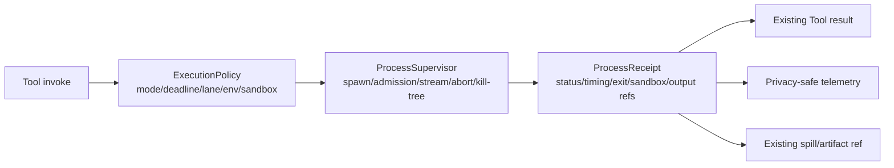
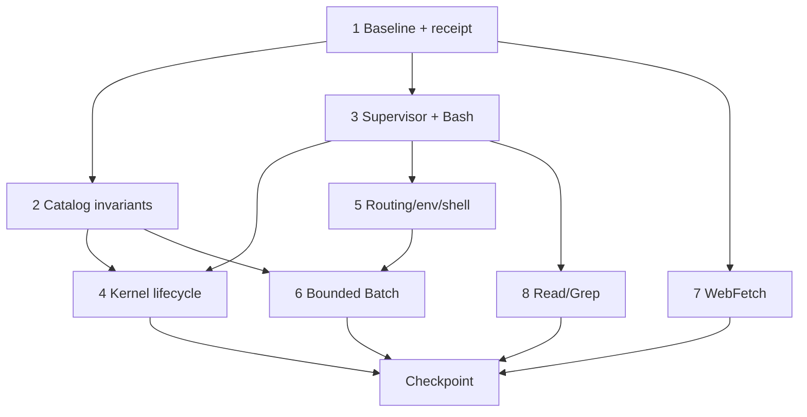

# 18 — Tool 执行运行时与资源效率优化

**Status:** Planned

**Priority:** P1

**Dependencies:** 无硬依赖。后端合并使用 Plan 00 的门槛；与 Plans 02、10、13、16 做边界协调。

## TL;DR

独立、可复现、无需跨调用状态的 Python/R 计算默认由现有 `bash` 工具启动一次性 `python`/`Rscript` 进程；只有需要复用变量、已加载模型或富 MIME 输出时才显式使用 `notebook`/`rkernel`。这不会新增 Python/R 公共工具，也不会把本地 Bash 冒充成计算节点。

计划先建立统一的 `ExecutionPolicy -> ProcessSupervisor -> ProcessReceipt` 边界，再收敛 Bash 输出、kernel 生命周期、凭据与 sandbox、Batch 并发以及外围 I/O 工具。所有收益都用真实进程、真实网络服务和大文件测试证明，不以“应该更快/更省”作为完成证据。

## Current state

| 路径                  | 当前生命周期                                     | 已有能力                                                     | 主要问题                                                                                       |
| --------------------- | ------------------------------------------------ | ------------------------------------------------------------ | ---------------------------------------------------------------------------------------------- |
| `bash` 调 Python/R    | 每次调用都 spawn 新 shell/解释器，命令结束即退出 | permission、可选 sandbox、abort、kill-tree、secret redaction | 文档误称 persistent；实际默认 timeout 为 `0`；无科学线程 cap；全量累积输出并反复重做 redaction |
| `notebook`            | 每个 session 一个 Python 常驻进程                | 跨 cell 状态、结构化错误、HTML/PNG                           | 启动时预导入科学包；idle reap 只在下次 `get()` 触发；session 删除不释放；输出未统一脱敏        |
| `rkernel`             | 每个 session 一个 `Rscript` 常驻进程             | 跨调用全局环境、warning/message、PNG                         | 同样不做真实定时回收；每次调用重复探测版本；无统一线程 cap/输出脱敏                            |
| `SessionPrompt.shell` | 独立 spawn 用户 shell                            | 会话内 shell part                                            | 绕开 BashTool 的统一 permission、sandbox、timeout 和 terminal receipt                          |
| `batch`               | 最多 25 个调用直接 `Promise.all`                 | 并行聚合结果                                                 | 从全 registry 重新取工具，未消费当前 profile/selection；可并行启动 stateful/heavy 工具         |

代码审计确认以下具体漂移：

- `backend/cli/src/tool/bash.ts` 的默认 timeout 来自 flag，否则为 `0`；`bash.txt` 却写成默认 120 秒。
- Bash 只使用 `OpenScience.subprocessEnv()`；`pythonThreadCapEnv()` 目前仅应用于 Python kernel，R 和 Bash one-shot 均可能让 BLAS/joblib 按全核扇出。
- notebook/rkernel 所称的 30 分钟 idle 回收只在下一次 kernel `get()` 时检查；无后续调用时进程可存活到 CLI 退出。
- 通用 notebook 与 biology legacy notebook 都注册为 `notebook`；按 ID 做 capability filter 后，声明拥有 notebook 的非 biology profile 反而可能拿不到工具，重复项最终被静默覆盖。
- Bash 在每个 stdout/stderr chunk 上把累计全文重新脱敏，并把完整输出留在内存直到工具返回；大输出呈近似 O(n²) 复制与 O(output) 内存增长。
- `subprocessEnv()` 可注入用户 BYOK/compute credentials；Bash 会脱敏输出，notebook/rkernel 没有同一 redaction seam。
- 当前 sandbox 是写路径与可选网络隔离，不是 CPU/RSS/磁盘配额；默认可关闭，Windows 没有等价 backend。
- `batch` 使用空 model、无 agent 的 registry 并直接调用 `tool.execute`，可能绕过当前 profile availability 和统一 invoke hooks。
- `webfetch` 只校验初始 URL，默认 redirect 后未逐跳复核；收到 headers 后就清除 timeout，body 读取不再受 deadline 保护。
- `read` 虽然只返回 bounded preview，仍先 `file.text().split()` 读取全文件；`grep` 也先收集完整 stdout 再裁剪结果。

## Problem

仅在提示词中要求“用 Bash 调 Python/R”只能消除常驻 kernel，却不能自动解决瞬时线程扇出、无限 timeout、凭据继承、并发风暴、输出内存或跨平台隔离。若每种工具继续自行 spawn、拼接输出和判定终态，修复会在 Bash、kernel、用户 shell 与 Batch 之间反复漂移。

同时，Plan 18 不能演变成第二套 Agent scheduler、第二套 artifact store 或一轮重复的 schema/MCP 优化。需要明确 process runtime 与既有计划的所有权边界。

## Goals

1. 让无状态 Python/R 默认走一次性进程，退出后不保留解释器、变量、native library 或 GPU context。
2. 为 Bash、Python/R kernel 和用户 shell 提供一致的 deadline、abort、kill-tree、并发、环境、sandbox、输出与终态收据。
3. 保留 notebook/rkernel 的状态复用与富输出价值，同时让它们真实、可预测地回收。
4. 修复 tool catalog/profile 漂移和 Batch availability 绕过，禁止重型/有状态工具无界 fan-out。
5. 用隐私安全 telemetry 和可复跑 benchmark 决定 break-even、默认值与 rollout，而不是预设速度提升。
6. 为 WebFetch、Read、Grep 等外围工具补齐与其输入规模相匹配的 bounded I/O 护栏。

## Non-goals

- 不新增 `python`、`r` 或统一 mega-dispatcher 公共工具；保留 `bash`、`notebook`、`rkernel` 的现有 ID 和输入兼容。
- 不实现 warm interpreter pool。无法可靠清空 native library、GPU context 和内存碎片的 pool 本质上仍是 kernel。
- 不在本计划实现 SSH、容器或云端 compute dispatch；GPU、大内存和 durable job 只做明确路由/拒绝，不静默回落成本地 Bash。
- 不把 Seatbelt/bubblewrap 或线程环境变量描述为硬 CPU/RSS 隔离。真正配额需要 cgroup/container/Windows Job Object 或远端执行后端。
- 不改 TaskResult 契约；`ProcessReceipt` 是 additive 的工具进程收据，TaskResult 仍由 Plan 01 管理 child-agent 边界。
- 不重复 Plan 02 的 schema slimming、MCP manifest cache soak 和通用 result-bound rollout。
- 不建立第二套 TaskScheduler。Plan 10 管 child admission；本计划只管 child 内部的本地进程 lane，两者不互相持有 permit。
- 不改变 Plan 16 的 artifact catalog/store/API；本计划只产出已脱敏 spill/ref。

## Proposed design

### Execution routing

| 工作负载                                   | 默认路径                      | 选择条件                                 | 退出/资源语义                                                  |
| ------------------------------------------ | ----------------------------- | ---------------------------------------- | -------------------------------------------------------------- |
| 独立 Python 脚本、数据转换、统计检验       | `bash` -> configured Python   | 不需要跨调用变量或 rich display          | 一次性进程；success/failure/cancel/timeout 后回收整棵进程树    |
| 独立 R 脚本、可复现批处理                  | `bash` -> `Rscript --vanilla` | 不需要跨调用 workspace                   | 一次性进程；同一 thread/deadline/output policy                 |
| 多 cell 探索、复用大对象/模型、富 HTML/PNG | `notebook` / `rkernel`        | 状态复用收益经用户意图或任务结构明确成立 | session-scoped、串行执行、有限 TTL、显式 release               |
| GPU、大内存、长时、高并行或付费计算        | compute worker/remote node    | 超过本地 policy 或明确选择远端           | 本计划不实现远端；backend 不可用时明确报告，不伪装本地计算节点 |

路由由工具说明和 Agent prompt 表达意图，但 deadline、并发、env、sandbox、redaction 与 terminal status 必须由代码 policy 强制。父 Orchestrator 继续不持有 `bash`；它只委派给允许本地计算的 worker。

### Runtime boundary



`ProcessReceipt` 最小字段：

```text
callID, sessionID, runtime, mode, lane
status: success | failure | cancelled | timeout
queuedAt, startedAt, endedAt, waitMs, runMs
exitCode?, signal?, failureClass?
sandbox: requested | enforced | degraded | unavailable, backend?
output: inlineBytes, totalBytes, truncated, spilled, ref?
```

收据不得记录代码、完整命令、prompt、env 值、凭据、输出正文或绝对工作路径。只允许相对路径或不可逆 command hash 用于关联。terminal 状态不可逆；timeout/cancel 后的迟到 exit 只能补诊断，不能回写 success。

### Resource policy

- 新 runtime 路径使用非零默认 deadline，并受配置上限与剩余 parent deadline clamp；legacy `timeout=0` 只在 flag-off 兼容路径存在。
- scientific one-shot 默认设置 `min(4, logical CPUs)` 的 BLAS/OpenMP/joblib/numba/R 线程 cap；显式配置覆盖必须经过 policy 并有上下界测试。
- general process 与 scientific process 使用有界 lane；排队可取消，不在等待一个 permit 时持有另一个 scheduler permit。
- stdout/stderr 边运行边脱敏并 spill；内存只保留固定 head/tail/severity preview 与 redaction overlap，metadata 更新节流且最终强制 flush。
- subprocess env 改为 capability allowlist。基础本地计算默认看不到 LLM/compute keys；确实需要 provider 的 skill/compute path 显式声明能力。
- `sandbox=strict` 且 backend 不可用时 fail closed；非 strict 降级必须在 receipt 和用户可见 metadata 中明确标注。
- 本地进程统一标记 `costClass=local`，不得触发 managed usage；远端/付费语义留给显式 compute capability。

## Coordination boundaries

| 计划       | Plan 18 的边界                                                                                                        |
| ---------- | --------------------------------------------------------------------------------------------------------------------- |
| Plan 00    | 所有 runtime 代码合入前执行其完整后端门槛；Plan 18 不复制 coverage 数值                                               |
| Plan 02    | Plan 18 产出 effective toolset 与 runtime telemetry；Plan 02 继续拥有 schema、MCP cache soak、通用 result bounding    |
| Plan 09/11 | 父 Orchestrator 不获得 Bash；ephemeral routing 与 capability 边界应在默认评测冻结前落地                               |
| Plan 10    | 用 `runID/sessionID/callID` 关联 TaskRun 与 ProcessReceipt；TaskScheduler 和 ProcessSupervisor 不共享/嵌套持有 permit |
| Plan 13    | 先固定 `SessionPrompt.shell` 与 invoke event characterization，再串行迁移相同代码区，避免同时重写 `prompt.ts`         |
| Plan 16    | spill 只复用其 artifact 注册契约；不在 Plan 18 发明 catalog、preview API 或 UI                                        |

## Implementation tasks

### Task 1: 冻结真实运行基线与 ProcessReceipt 契约

**Description:** 在不改变默认路由的前提下，建立可复跑 benchmark、additive `ExecutionPolicy`/`ProcessReceipt` 类型和隐私安全 telemetry schema，记录 Bash one-shot、kernel cold/warm、用户 shell、大输出与 fan-out 的真实成本。

**Acceptance:**

- [ ] 30 次 Python one-shot、30 次 notebook cold/warm 均记录 p50/p95 wall time、child/idle process 数、peak RSS、CPU、output bytes 和 cancel latency。
- [ ] R 可用时执行同样的 30 次 `Rscript`/rkernel 测量；不可用时仅跳过 R-specific case，并输出 binary discovery 的明确原因。
- [ ] characterization 证明两次 Bash 调用不共享 PID、变量/import state；同 session kernel 保留状态，release 后重建。
- [ ] 10 MiB 与 100 MiB 输出、20+ fan-out、non-zero exit、timeout、cancel 和 session delete 都有 baseline。
- [ ] receipt terminal reducer 拒绝 timeout/cancel/failure 后的 success；重复同终态幂等。
- [ ] telemetry 只含工具来源、runtime、timing、status、字节数、spill/cache 标志和匿名关联 ID，不含 args/content/绝对路径/env/secret。
- [ ] 记录 before 数据，不把当前机器的绝对耗时直接写成跨平台硬阈值。

**Verification:**

- [ ] `(cwd: backend/cli) bun test test/tool/execution-characterization.test.ts test/session/telemetry.test.ts`
- [ ] `(cwd: backend/cli) bun run script/bench-tool-runtime.ts --iterations 30`
- [ ] 连续运行 benchmark 两次，确认字段排序稳定且原始命令/secret 未进入报告。

**Dependencies:** 无；与 Plan 10 的 TaskRun 字段命名对齐，但不等待其 scheduler 实现。  
**Files:** `backend/cli/src/process/types.ts`（新增）、`backend/cli/src/session/telemetry.ts`、`backend/cli/script/bench-tool-runtime.ts`（新增）、`backend/cli/test/tool/execution-characterization.test.ts`（新增）、`backend/cli/test/session/telemetry.test.ts`。  
**Scope:** M（5 files）

### Task 2: 建立 catalog、profile 与 origin 权限不变量

**Description:** 清除重复 notebook，实现 built-in/plugin catalog collision policy，并对每个 shipped agent 的“声明 profile -> capability filter -> 最终初始化工具”做 contract test。

**Acceptance:**

- [ ] 删除 legacy biology notebook 或改成明确、唯一 ID；通用 `notebook` 只注册一次。
- [ ] 所有 built-in ID 全局唯一；plugin 与 native 同名时 fail closed 或要求显式 namespace，不再静默 shadow。
- [ ] biology/research/ml/physics 的有效 notebook 集与声明一致；physics artifact、EXPLORE `list` 等 dead/missing profile ID 被修复或显式移除。
- [ ] capability-denied origin 在 `init()`/schema conversion 前过滤；denied tool 的 init 次数和 schema bytes 均为 0。
- [ ] 每个 native agent 有 deterministic effective ID snapshot；registry 顺序变化不会靠 Record 最后写入决定行为。
- [ ] 此任务不做 schema 文案缩减；测得的 schema outlier 交给 Plan 02。

**Verification:**

- [ ] `(cwd: backend/cli) bun test test/tool/registry.test.ts test/tool/selection.test.ts test/agent/agent.test.ts`
- [ ] 负向 fixture 注入 duplicate native/plugin ID，确认启动/注册明确失败且不会初始化冲突工具。

**Dependencies:** Task 1 的 effective-tool telemetry schema。  
**Files:** `backend/cli/src/tool/registry.ts`、`backend/cli/src/tool/biology/index.ts`、`backend/cli/src/tool/biology/notebook.ts`（删除）、`backend/cli/src/tool/profile.ts`、`backend/cli/test/tool/registry.test.ts`。  
**Scope:** S（5 files）

### Task 3: 用 ProcessSupervisor 接管 Bash 与一次性 Python/R

**Description:** 抽取共享 ProcessSupervisor，先接入 BashTool；修正 timeout 契约、scientific thread caps、permission-before-side-effect、bounded streaming、跨 chunk redaction、abort/kill-tree 和 receipt。

**Acceptance:**

- [ ] `bash.txt` 明确 Bash 是每调用一次的新进程；实现、schema 和文档使用同一非零默认 timeout，并设置可配置最大值。
- [ ] Python/R one-shot 自动获得统一 scientific thread caps；配置覆盖不会被 ambient env 悄悄绕过。
- [ ] cwd 创建、文件 spill 和 process spawn 均发生在相关 permission 通过之后。
- [ ] stdout/stderr 不再累计完整字符串，也不在每个 chunk 重扫历史；metadata 更新最多 10 Hz，并保留原始 part start time。
- [ ] secret 即使跨 chunk 边界，也不会出现在 preview、metadata、最终 output 或 spill。
- [ ] inline preview 不超过 `Truncate` 的 50 KiB/2,000 行预算；100 MiB 输出时保留内存与总输出大小解耦，完整已脱敏内容仍可用 Read/Grep 访问。
- [ ] success/failure/cancel/timeout 后 2 秒内无存活后代；cancel latency p95 不超过 2 秒；terminal receipt 不回跳。
- [ ] sandbox backend、降级 warning、exit code、signal、duration 和 spill ref 可诊断，旧 `output/exit/description` metadata 仍可读。

**Verification:**

- [ ] `(cwd: backend/cli) bun test test/tool/bash.test.ts test/tool/bash-sandbox.test.ts test/shell/shell.test.ts test/openscience-thread-cap.test.ts`
- [ ] 真实 Python/R/child-tree 测试覆盖 success、non-zero、timeout、abort、跨 chunk secret 与 100 MiB 输出；不 mock supervisor。
- [ ] `(cwd: backend/cli) bun run typecheck`

**Dependencies:** Task 1。  
**Files:** `backend/cli/src/process/supervisor.ts`（新增）、`backend/cli/src/tool/bash.ts`、`backend/cli/src/tool/bash.txt`、`backend/cli/src/openscience/index.ts`、`backend/cli/test/tool/bash.test.ts`。  
**Scope:** M（5 files）

### Task 4: 收敛 persistent kernel 生命周期、安全与并发

**Description:** 让 notebook/rkernel 复用 supervisor 的 spawn/output/receipt seam，加入真实 timer、session release、同 session 串行和全局 cap；保留状态复用与 rich output。

**Acceptance:**

- [ ] 默认仍保留兼容的 30 分钟 TTL，但由真实 scheduler/timer 回收，不依赖下一次 `get()`；TTL 可配置并在 Task 1 数据后调整。
- [ ] `Session.Event.Deleted` 立即 release Python/R；CLI shutdown、start failure、timeout 和 abort 后 map 中不保留假 ready instance。
- [ ] 同 session/language 的 start 与 execute 串行；并发调用不会双建 kernel、交叉消费结果 frame 或产生 orphan。
- [ ] 初始 global kernel cap 为 2、每 session 每 runtime cap 为 1；排队可取消，且不占用 Plan 10 的 child permit。
- [ ] notebook/rkernel 使用同一 secret redaction、sandbox warning、bounded output 和 terminal receipt；stdout/stderr/HTML/PNG metadata 均无 secret。
- [ ] R version discovery 按 binary/version 缓存，不再每次工具调用重复运行 `Rscript --version`。
- [ ] sandbox 下 Python/R rich output 有真实测试；父进程无法访问 namespace 临时 PNG 时明确失败或通过既有 artifact seam 转移，不静默丢图。

**Verification:**

- [ ] `(cwd: backend/cli) bun test test/tool/kernel-runtime.test.ts test/tool/kernel-sandbox.test.ts test/tool/registry.test.ts test/agent/agent.test.ts`
- [ ] 真实并发测试覆盖双 `get()`、并行 execute、idle TTL、session delete、shutdown、timeout 和 abort。
- [ ] Windows 无 R 时只跳过 R-specific case；Python lifecycle、sandbox 降级和 child cleanup 仍必须运行。

**Dependencies:** Tasks 2–3。  
**Files:** `backend/cli/src/tool/notebook.ts`、`backend/cli/src/tool/rkernel.ts`、`backend/cli/src/science/kernel/lifecycle.ts`（新增）、`backend/cli/src/project/bootstrap.ts`、`backend/cli/test/tool/kernel-runtime.test.ts`（新增）。  
**Scope:** M（5 files）

### Task 5: 落地 ephemeral-first 路由、scoped env 与用户 shell

**Description:** 用 ExecutionPolicy 强制 ephemeral/session 路由边界，将 `SessionPrompt.shell` 接入同一 supervisor，并分阶段收紧 subprocess credential 与 strict sandbox 行为。

**Acceptance:**

- [ ] 通用说明统一为：独立计算默认 `bash` one-shot；只有跨 cell 状态、重复加载大对象或 rich display 才选择 kernel。
- [ ] biology prompt 不再无条件要求 notebook；默认 research 路径先通过 prompt/flag 路由到 ephemeral，kernel ID 在兼容期仍可显式使用。
- [ ] `SessionPrompt.shell` 使用同一 deadline、permission、sandbox、bounded output、redaction、kill-tree 和 receipt；abort 不再落成 completed success。
- [ ] `experimental.tool_runtime` 支持 `off -> shadow -> bash -> scientific -> shell -> on` 阶段；每阶段保留旧 metadata 和一次兼容周期。
- [ ] `scoped_subprocess_env` 独立 rollout：shadow 只记录所需变量名/能力，不记录值；enforce 后未声明 capability 的 Bash/Python/R 看不到 LLM/compute key。
- [ ] strict sandbox 在 Windows/缺失 backend 时明确拒绝；非 strict 才允许带 warning 降级。
- [ ] 本地运行 receipt 标记 `costClass=local` 且不发 managed usage；本计划不通过 shell 文本猜测远端/付费调用。
- [ ] 父 Orchestrator effective toolset 继续不含 `bash`、`notebook`、`rkernel`。

**Verification:**

- [ ] `(cwd: backend/cli) bun test test/tool/execution-policy.test.ts test/session/message-v2.test.ts test/shell/shell.test.ts test/agent/agent.test.ts`
- [ ] 同一个 canary secret 经 Bash/notebook/rkernel/用户 shell 的 stdout、stderr、stream metadata 和 spill 均为 0 泄漏。
- [ ] flag 每个阶段各跑一次 success/error/cancel/timeout；flag off 保持 legacy 可回退。

**Dependencies:** Task 3；迁移 `SessionPrompt.shell` 前先完成 Plan 13 的 shell event characterization，并串行修改 `prompt.ts`。  
**Files:** `backend/cli/src/config/config.ts`、`backend/cli/src/process/policy.ts`（新增）、`backend/cli/src/session/prompt.ts`、`backend/cli/src/agent/prompt/biology.txt`、`backend/cli/test/tool/execution-policy.test.ts`（新增）。  
**Scope:** M（5 files）

### Task 6: 让 Batch 使用 capability-scoped invoker 与有界并发

**Description:** Batch 不再重新加载全 registry 或直接调用裸 `tool.execute`，而只消费当前 turn 已 resolve/selected 的 handles，并复用统一 permission/hooks/part envelope。

**Acceptance:**

- [ ] profile、origin permission 或当前 selection 排除的工具无法被猜 ID 调用；availability bypass 为 0。
- [ ] v1 仅允许声明为 read-only/light 的工具进入 Batch；`bash`、`task`、`notebook`、`rkernel`、artifact mutation、edit/write 和交互工具默认拒绝。
- [ ] 并发上限默认 4，使用可取消 semaphore；不再对 25 个调用直接 `Promise.all`。
- [ ] 每个 inner call 的 permission、plugin before/after hook、part start/end 和 telemetry 各发生一次。
- [ ] 一个 inner failure 不改写其他结果；父 abort 会停止排队调用并把 running 调用的 signal 传到底层，无 orphan/listener leak。
- [ ] 不把 Batch 扩展成动态 mega-dispatcher，也不复制 Plan 10 的 TaskScheduler。

**Verification:**

- [ ] `(cwd: backend/cli) bun test test/tool/batch.test.ts test/tool/selection.test.ts test/tool/registry.test.ts`
- [ ] 20+ 调用 soak 断言 peak active 不超过 cap，denied/profile-excluded/stateful 工具执行次数为 0。
- [ ] 注入 permission denial、partial failure 和 abort，验证 hooks/parts/terminal receipt 一致。

**Dependencies:** Tasks 2、5；若 Plan 13 的 unified invoke helper 已落地则直接消费，未落地时只增加最小 capability-scoped invoker，不建立第二套 envelope。  
**Files:** `backend/cli/src/tool/batch.ts`、`backend/cli/src/tool/tool.ts`、`backend/cli/src/session/prompt.ts`、`backend/cli/test/tool/batch.test.ts`（新增）、`backend/cli/test/tool/selection.test.ts`。  
**Scope:** M（5 files）

### Task 7: 硬化 WebFetch redirect、SSRF 与 body deadline

**Description:** 对每个 redirect hop 重新执行 network policy，保持 deadline 覆盖 headers 与 body，并流式执行响应大小上限。

**Acceptance:**

- [ ] 使用 manual redirect 和有限 hop count；每个 Location 在发起下一跳前校验 scheme、host、DNS/private/loopback policy。
- [ ] public URL redirect 到 loopback、RFC1918、link-local 或 policy-denied host 时，在第二个请求发出前拒绝。
- [ ] 同一个 abort/deadline 覆盖 initial request、Cloudflare retry、redirect chain 和完整 body 消费；收到 headers 不再提前清 timer。
- [ ] body 按 stream 读取，超过 5 MiB 立即 cancel reader/connection，不先分配完整 `arrayBuffer`。
- [ ] permission metadata 与最终 title 使用实际/安全化 URL，不泄露 credential-bearing URL；错误包含稳定 failure class。

**Verification:**

- [ ] `(cwd: backend/cli) bun test test/tool/webfetch-network.test.ts test/settings/network.test.ts`
- [ ] 使用本地真实 HTTP server 覆盖多跳、redirect-to-private、慢 body、chunked oversize、abort 和 retry；不 mock `fetch` 判定逻辑。

**Dependencies:** Task 1 的 receipt/failure class；可与 Tasks 2–4 并行。  
**Files:** `backend/cli/src/tool/webfetch.ts`、`backend/cli/src/settings/network.ts`、`backend/cli/test/tool/webfetch-network.test.ts`。  
**Scope:** S（3 files）

### Task 8: 让 Read/Grep 在输入源头 bounded

**Description:** Read 只流式扫描请求的 offset/limit/byte budget，Grep 在结果预算达到时停止读取并终止子进程，避免“返回已截断但运行时先吃完整输入/输出”。

**Acceptance:**

- [ ] Read 不再对大文本调用全量 `file.text().split()`；offset、limit、50 KiB 截断提示与 binary/图片兼容行为保持。
- [ ] Grep 在 100 条/byte budget 达到后停止 stdout 消费并回收 `rg`，同时区分 no-match、truncated、abort 与真实 command failure。
- [ ] 100 MiB 文本和高匹配率 fixture 下，parent retained memory 与文件/匹配总量解耦。
- [ ] offset/line number、UTF-8 chunk boundary、CRLF、超长单行和最后无换行文件有真实测试。
- [ ] spill/artifact 仍使用既有路径；不在此任务修改 Plan 16 的 catalog/API。

**Verification:**

- [ ] `(cwd: backend/cli) bun test test/tool/read.test.ts test/tool/grep.test.ts`
- [ ] 对 10 MiB/100 MiB fixture 比较 peak RSS，确认增长受固定 stream/preview budget 限制。

**Dependencies:** Task 3 的 bounded stream primitive；可在 Task 6 后独立完成。  
**Files:** `backend/cli/src/tool/read.ts`、`backend/cli/src/tool/grep.ts`、`backend/cli/test/tool/read.test.ts`、`backend/cli/test/tool/grep.test.ts`。  
**Scope:** M（4 files）

## Execution order



Tasks 2、3、7 在 Task 1 后可并行。Tasks 5、6 都修改 `session/prompt.ts`，必须串行；Task 5 与 Plan 13 的 characterization 也必须串行。若实现分支超过一个独立子系统或超过本任务文件预算，按图继续拆分，不把多个任务塞进一个 PR。

## Measured release gates

- [ ] Python/R one-shot 在 success/failure/cancel/timeout 后 2 秒内均为 0 个存活后代；cancel latency p95 <= 2 秒。
- [ ] 默认 deadline 非零、有上限，并被剩余 parent deadline clamp；timeout receipt 永不回跳 completed/success。
- [ ] Python 与 R 真实子进程看到统一 thread caps；默认不超过 4，配置覆盖的允许/拒绝边界有正反测试。
- [ ] global/session/scientific lane peak 永不超过配置；20+ Batch/process fan-out 无 permit、listener 或 process leak。
- [ ] 10 MiB 与 100 MiB 输出的 retained buffer 都受同一 preview/redaction budget 约束；100 MiB 测试不出现随总输出线性增长的 parent heap。
- [ ] 同一 canary secret 在 Bash/notebook/rkernel/用户 shell 的 stdout、stderr、metadata、receipt 与 spill 中泄漏数为 0。
- [ ] 未声明 capability 的本地计算进程看到的 LLM/compute credential 数为 0；local run 的 managed usage report 数为 0。
- [ ] configured TTL 或 session delete 后 kernel 数为 0；同 session 并发不会产生第二个 kernel 或错配 frame。
- [ ] built-in tool duplicate ID 为 0；每个 native agent 的 effective IDs 与声明 profile 完全一致。
- [ ] Batch profile/permission bypass 为 0，active count 不超过 cap，stateful/heavy 工具执行数为 0。
- [ ] WebFetch redirect-to-private 请求数为 0；slow/oversize body 在 deadline/5 MiB budget 达到时终止。
- [ ] Task 1 的 before/after 报告记录 cold/warm p50/p95、peak RSS、alive descendants、output memory 与 cancel latency；没有数值证据不得宣称优化完成。

## Rollout and rollback

1. `experimental.tool_runtime=off`：完整 legacy 路径，先跑 characterization。
2. `shadow`：只生成 receipt/metrics，不改变 spawn、env 或 routing。
3. `bash`：Bash 使用 supervisor、有限 timeout 和 bounded output。
4. `scientific`：ephemeral-first 生效，kernel 加真实 lifecycle/caps。
5. `shell`：用户 shell 迁移到同一 runtime。
6. `on`：Batch 和外围 I/O 门槛通过后成为默认；保留 flag-off 一个兼容周期。

`scoped_subprocess_env` 单独从 shadow 到 enforce，发生 skill 兼容问题时可只回退 env policy。duplicate ID fail-fast、secret redaction、terminal guard 和 kill-tree 属于 correctness/security fix，不随性能 rollout 回滚。strict sandbox 不得静默降级；只有显式 non-strict 配置可回退到带 warning 的 legacy execution。

## Other tool optimization backlog

| 优先级 | 候选                                        | 证据/建议                                                                                                                                                                 | 所有权与进入条件                                                                                       |
| ------ | ------------------------------------------- | ------------------------------------------------------------------------------------------------------------------------------------------------------------------------- | ------------------------------------------------------------------------------------------------------ |
| P1     | MCP demand-driven discovery 与 timeout 分层 | 当前可能先连接/列举再 selection，且 connect/list/call 共享一个 timeout；应先按 server prefix/profile/deny cheap gate，再并行 manifest，拆分 startup/manifest/call timeout | Plan 02；复用其真实 SDK server 和 manifest cache soak，Plan 18 不重复实现                              |
| P1     | MCP/native/plugin sanitized ID collision    | lossy ID sanitize 可能碰撞；应 namespace 或 fail closed，并让 deny 在 schema conversion 前生效                                                                            | Plan 02 + Task 2 catalog invariant；先有 collision fixture                                             |
| P1     | Artifact range/preview                      | `artifact resolve` 可全量读后再次 spill；增加 additive offset/limit/preview，避免双写大结果                                                                               | Plan 16 拥有 metadata/catalog/API；其契约落地后实施                                                    |
| P1     | 通用 tool failure envelope                  | artifact/science/atlas/processor 对 Error、completed text 和 metadata.error 的表达不一致                                                                                  | 另开 TaskResult 之外的 tool-result 兼容计划；先消费 ProcessReceipt failureClass，不在 Plan 18 全量重写 |
| P2     | WebSearch/WebFetch request coalescing/cache | 重复 URL/查询可能浪费网络和 token，但错误缓存会隐藏新结果                                                                                                                 | 先用 Task 1 telemetry 证明命中率；只缓存明确可缓存响应并尊重 TTL/隐私                                  |
| P2     | Biology PubMed 能力去重                     | `query_pubmed` 与 `science_search(db=pubmed)` 重叠                                                                                                                        | 先做 capability/usage matrix 和迁移期；禁止直接删除公共 ID                                             |
| P2     | Tool schema 文案压缩                        | `bash`、todo、task 描述体积较大                                                                                                                                           | 由 Plan 02 的 measured outlier 流程处理，Plan 18 只提供 effective profile 基线                         |

## Risks

| Risk                                             | Impact                  | Mitigation                                                                                |
| ------------------------------------------------ | ----------------------- | ----------------------------------------------------------------------------------------- |
| one-shot 消除 idle RSS 却增加重复 import latency | 短循环变慢              | Task 1 测 cold/warm break-even；只有真实状态复用才选 kernel，不引入 warm pool             |
| 线程 cap 被误认为硬资源限制                      | 高内存任务仍可拖垮机器  | 文档明确 soft cap；strict workload 路由 container/remote，backend 不可用时拒绝            |
| env allowlist 切断依赖 provider key 的 skill     | 既有工作流失败          | 独立 shadow/enforce flag，只记变量名；按 capability 迁移并保留限期回退                    |
| streaming redaction 漏掉跨 chunk secret          | 凭据进入 session/spill  | 保留 overlap、最终 canary scan、四路径真实测试；redaction fix 不参与回滚                  |
| ProcessSupervisor 与 TaskScheduler 双重计数      | 死锁或吞吐异常          | 两者不嵌套持有 permit；只用 IDs 关联；fan-out stress 验证                                 |
| Batch 复用裸 execute 造成 permission/hook 漂移   | capability 绕过         | 只接受当前 selected invoker；stateful/write/process 默认拒绝                              |
| kernel timer 与正在执行的 cell 竞态              | 活跃进程被回收或 orphan | serialized lifecycle state、last-active monotonic time、execute permit 与 timer race test |
| Windows 无 sandbox/R                             | 跨平台门槛被假跳过      | strict sandbox 明确拒绝；只跳 R-specific case，其他 lifecycle/cleanup 测试照常运行        |
| streaming spill 与 Plan 16 重复 artifact store   | 两套不可维护路径        | 只复用既有 ref/registration seam，不改变 catalog/API                                      |

## Checkpoint

- [ ] Tasks 1–8 的 focused tests 全部通过，before/after benchmark 已写入 Progress。
- [ ] ephemeral/session 路由、deadline、lane、env、sandbox 与 receipt 契约一致。
- [ ] process/kernel success、failure、cancel、timeout、session delete 后无 orphan 或 terminal reversal。
- [ ] duplicate registry、profile drift、Batch availability bypass 和 secret leak 均为 0。
- [ ] 100 MiB process output、Read/Grep 输入和 WebFetch body 均在源头 bounded。
- [ ] flag off/shadow/各阶段 rollout 与 scoped env 回退均已演练。
- [ ] Plan 02/10/13/16 的所有权边界未被复制或破坏。

完整门槛：

```powershell
Set-Location backend/cli
bun test
bun run typecheck

Set-Location ../..
bun run typecheck
bun run build
```

本计划预计不改变服务端 API，因此不需要 SDK regeneration；若实施中新增设置/API，必须从仓库根运行 `./tooling/repo/generate.ts` 并提交生成结果。

## Definition of done

- [ ] Tasks 1–8、Measured release gates 与 Checkpoint 全部有可复跑证据。
- [ ] 独立 Python/R 默认使用 ephemeral path；kernel 只在状态/rich-output 条件下显式使用并按 TTL/session lifecycle 回收。
- [ ] 所有本地 process 路径共享 policy、supervisor、receipt、bounded output、redaction、abort 与 kill-tree 语义。
- [ ] catalog/profile/Batch 不再出现静默覆盖、dead declaration 或 capability bypass。
- [ ] local runtime 不泄露 provider/compute secret、不冒充 managed compute、不把 unavailable strict sandbox 静默降级。
- [ ] WebFetch、Read、Grep 的输入/输出预算在读取源头生效。
- [ ] `backend/cli` 完整 `bun test`、focused typecheck、根级 typecheck/build 通过并记录；Plan 00 合并门槛通过。
- [ ] Status/Progress、`tasks/plan.md`、`tasks/plans/README.md` 与 `tasks/todo.md` 已同步。

## Progress

- 2026-08-02：完成只读代码审计并建立独立 Plan 18；尚未实施代码或记录 before benchmark。
