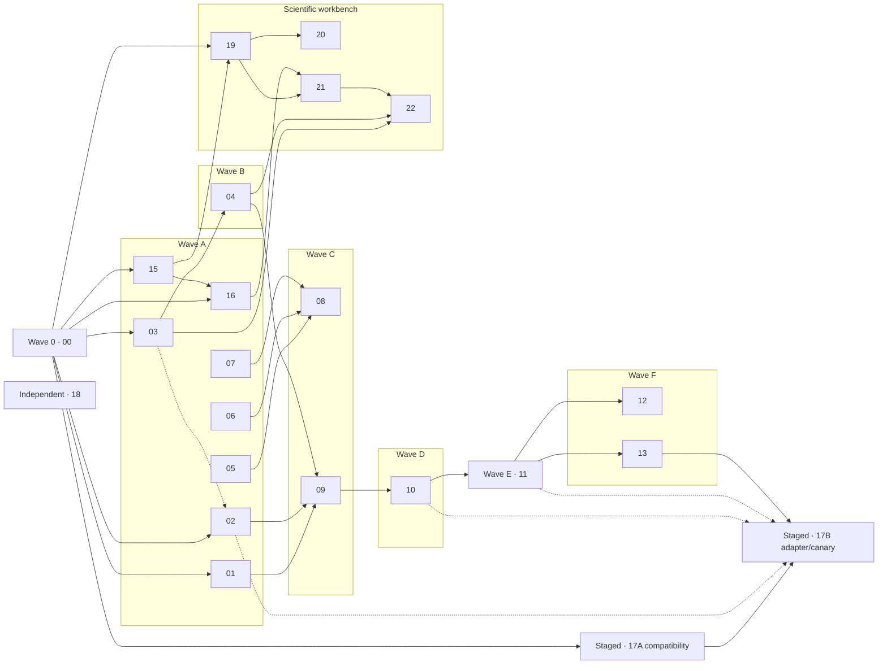

# MedHorizon 可执行优化计划

本目录包含 1 个后端合并前置护栏、21 份 active 优化计划和 1 份已被产品方向取代的历史计划。每份 active 计划的实施任务限定为 XS/S/M；执行者应一次只领取一个任务，并在计划内 checkpoint 通过后再进入下一个依赖节点。

## 状态说明

| 状态        | 含义                                                    |
| ----------- | ------------------------------------------------------- |
| Planned     | 已细化，尚未开始实现                                    |
| In progress | 已有负责人或工作分支正在实现                            |
| Blocked     | 存在明确的外部依赖或负责人决策                          |
| Done        | 所有任务、checkpoint 和 Definition of done 均有验证证据 |
| Superseded  | 产品方向已变化，保留历史内容但不得继续实施              |

## 计划目录

| #   | 计划                                                                  | 产出                                                          | 优先级 | 依赖                            | 状态        |
| --- | --------------------------------------------------------------------- | ------------------------------------------------------------- | ------ | ------------------------------- | ----------- |
| 00  | [CI/test guardrails](00-ci-test-guardrails.md)                        | frozen install、全量测试基线与 coverage floor                 | P0     | 无                              | In progress |
| 01  | [TaskResult contract](01-task-result-contract.md)                     | 统一、不可误判的 worker 结果判别联合                          | P0     | 00                              | Done        |
| 02  | [Agent context closeout](02-agent-context-closeout.md)                | schema 预算、cache/result-bound soak 与默认值结论             | P0     | 00、03（仅 RG soak）            | Planned     |
| 03  | [Research Graph supervisor](03-research-graph-supervisor.md)          | 可握手、可诊断、可重启的 sidecar 生命周期                     | P0     | 00                              | Done     |
| 04  | [Research Graph gateway](04-research-graph-gateway.md)                | 同源代理、随机 capability、权威 session 绑定和生成 SDK        | P0     | 03                              | Planned     |
| 05  | [UI feedback cleanup](05-ui-feedback-cleanup.md)                      | 删除死 Composer，收敛单一 Toast 通道                          | P1     | 无                              | Done        |
| 06  | [Settings dialogs](06-settings-dialogs.md)                            | 消除原生 prompt/confirm，统一可访问 Dialog                    | P1     | 无                              | Done     |
| 07  | [Async resource states](07-async-resource-states.md)                  | 文件与技能界面的 loading/empty/error/retry 原语               | P1     | 无                              | In progress |
| 08  | [Visual system and regression](08-visual-system-and-regression.md)    | 视觉令牌、代表页截图矩阵与 a11y smoke                         | P1     | 05、06、07                      | Planned     |
| 09  | [Orchestrator MVP](09-orchestrator-mvp.md)                            | 薄父 Agent、固定 worker 目录和真实委派                        | P1     | 01、02、04                      | Planned     |
| 10  | [Subagent scheduler](10-subagent-scheduler.md)                        | child/compute 并发、排队、取消、超时和终态                    | P1     | 09                              | Planned     |
| 11  | [Orchestrator evaluation](11-orchestrator-evaluation.md)              | 可复跑场景集、指标报告和发布门槛                              | P1     | 10                              | Planned     |
| 12  | [Orchestration UI](12-orchestration-ui.md)                            | 父子运行轨迹、取消入口、灰度与回退                            | P2     | 11                              | Planned     |
| 13  | [Session turn pipeline](13-session-turn-pipeline.md)                  | characterization 保护下的内部 pipeline 拆分                   | P2     | 11                              | Planned     |
| 14  | [Atlas Canvas architecture](14-graph-ui-architecture.md)              | 历史 Atlas Canvas 重构计划；由 15 取代                        | —      | 由 15 取代                      | Superseded  |
| 15  | [Atlas surface retirement](15-atlas-surface-retirement.md)            | 隐藏产品 UI、默认关闭云行为并保留 Stage/RG allowlist          | P0     | 00（后端任务）                  | Implemented |
| 16  | [Local artifact explorer](16-local-artifact-explorer.md)              | 可插拔 Explorer 壳、host files 与本地 session artifacts       | P1     | 00、15；T4←07 T1                | In progress (v0.3.20) |
| 17  | [Pi Agent Runtime migration](17-pi-runtime-migration.md)              | Bun/Pi 闸门、TurnRuntime 双 adapter、parity/canary/rollback   | P1→P2  | 00、01；切流依赖 02、10、11、13 | Planned     |
| 18  | [Tool runtime optimization](18-tool-runtime-optimization.md)          | ephemeral Python/R、统一进程运行时与有界工具执行              | P1     | 无硬依赖                        | Planned     |
| 19  | [Scientific file routing](19-scientific-file-routing.md)              | 科学文件识别、bounded inspect 与统一文档 tab renderer         | P1     | 00、15；T4←07 T1/T3             | In progress (v0.3.20) |
| 20  | [Interactive data table](20-interactive-data-table.md)                | CSV/TSV 分页、筛选、排序、schema 与大文件边界                 | P1     | 19                              | Planned     |
| 21  | [Project artifact evidence](21-project-artifact-evidence.md)          | discovery、manifest/audit、inspector、annotations、provenance | P1     | 19；UI 依赖 16                  | Planned     |
| 22  | [Research Graph evidence](22-research-graph-evidence-interactions.md) | 在唯一 RG 中增加 evidence 投影、过滤、聚焦与回源              | P1     | 03、04、21                      | Planned     |

## 并行执行矩阵



## 执行约定

1. 从计划元数据确认依赖已完成，再领取一个实施任务。
2. 先运行该计划记录的基线或 characterization tests；若基线本身失败，记录为独立 blocker，不把它混同为本次回归。
3. 按任务预计文件控制改动面；发现需要跨越第二个独立子系统时，停止并拆出后续任务。
4. 运行任务级验证；每完成 2–3 个任务运行计划 checkpoint。
5. API 变化时先固定服务端契约，再从仓库根显式运行 `bun tooling/repo/generate.ts`，最后迁移前端消费者；generator 会格式化生成物，只能在干净 worktree 串行运行。
6. 更新计划 Status/Progress、[总清单](../todo.md) 和必要的架构决策记录；不要只凭代码已写完标记 Done。
7. Plan 18 可作为独立横向计划推进；若与 Plans 02、10、13、16 修改同一契约或核心文件，按其 Coordination boundaries 串行实施。
8. Plans 19→20/21→22 按 classification、artifact identity、RG projection 契约串行；Plan 19 冻结后 20 与 21 可并行，Plan 21 的 Explorer 接入等待 Plan 16 core。
9. Plan 17 Task 1 可在 Plan 00/01 后先行；Tasks 2–8 复用 Plans 02/10/11/13/18 的事实源。与 Plan 13 共享 `prompt.ts`、runtime port 或 invoke envelope 时必须由同一 owner 串行实施，不建立第二套 session/tool/safety 路径。
10. Plans 07/16/19 的 UI 顺序固定为：Plan 07 Task 1 → Plan 16 Task 4，Plan 07 Task 3 → Plan 19 Task 4；Plan 16 独占 `session.tsx` Explorer 接线，Plan 19 默认保持该文件 0 行修改。三者的 workspace E2E 共用 `.env.local`，不得并行。

## 全局验收命令

以下是收尾门槛，不替代各计划中的 focused verification：

```powershell
# 仓库根
bun run typecheck
bun run build

# 后端完整测试
Set-Location backend/cli
bun run test:coverage

# workspace 交互测试
Set-Location ../../frontend/workspace
bun run typecheck
bun run test:e2e
```

Research Graph 的 Python 测试应使用其项目已配置的环境执行；具体 focused 命令以计划 03、04 为准。后端完整测试与 coverage 基线只在 Plan 00 的 Progress 维护，其他计划不要复制数值。
